# praxis

Sistema web de gestão para escritórios de advocacia — processos, prazos e honorários.
Projeto acadêmico da disciplina de Requisitos e Fundamentos de Software (CESAR School), com **DDD**, **arquitetura limpa**, **padrões de projeto GoF**, persistência relacional com ORM e cenários **BDD automatizados com Cucumber**.

## Objetivo

Um escritório de advocacia perde causas por **prazo** e perde tempo por **retrabalho**. O praxis existe para duas coisas:

1. **Nenhum prazo processual passa em silêncio.** O advogado lança a intimação; o sistema calcula o vencimento pela regra do CPC (dias úteis, feriados do foro, recesso), congela essa data e avisa o responsável de forma escalonada — 5, 3, 1 e 0 dias antes, e de novo se o prazo for perdido — sem repetir o mesmo aviso.
2. **Nenhuma peça sai do escritório sem estrutura nem revisão.** Petição, contestação e procuração nascem de template com esqueleto fixo (ou de modelo cadastrado pelo próprio escritório), ficam registradas nos autos, respeitam o segredo de justiça e só são protocoladas depois de passar pela revisão do chefe.

Em volta disso ficam os apoios que o dia a dia exige: cadastro de processos com linha do tempo, anexos, feriados, modelos, honorários, audiências, clientes e partes contrárias — e o controle de quem pode fazer o quê (advogado × chefe).

## Telas

Capturas da interface real, logado como chefe (`admin`) e como advogada (`ana.souza`). Todas em [`docs/prototipos/`](docs/prototipos/).

| | |
|---|---|
| **Login** — usuário curto ou e-mail; 5 erros bloqueiam o e-mail por 1 min 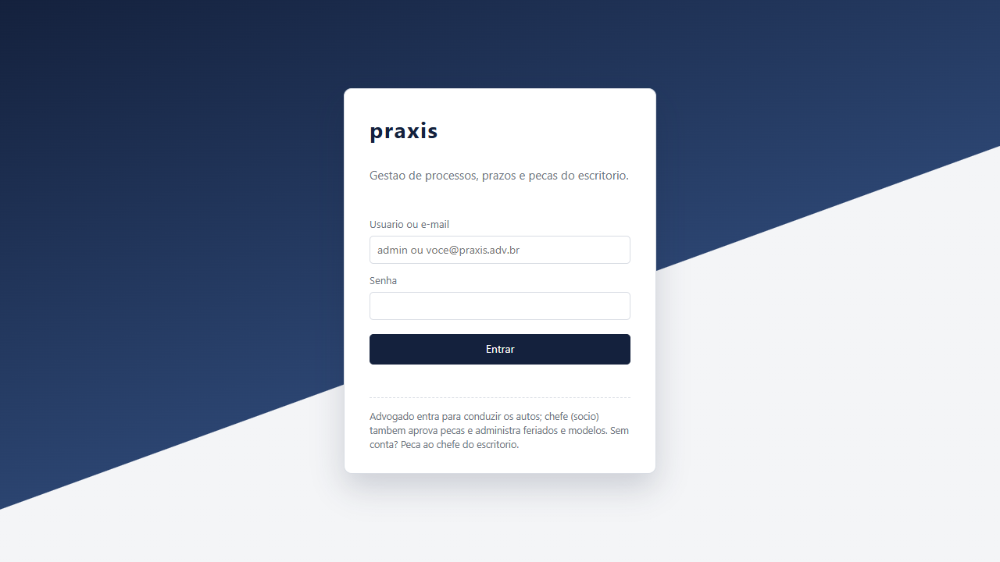 | **Agenda** — resumo do dia, prazos por vencimento, avisos do motor 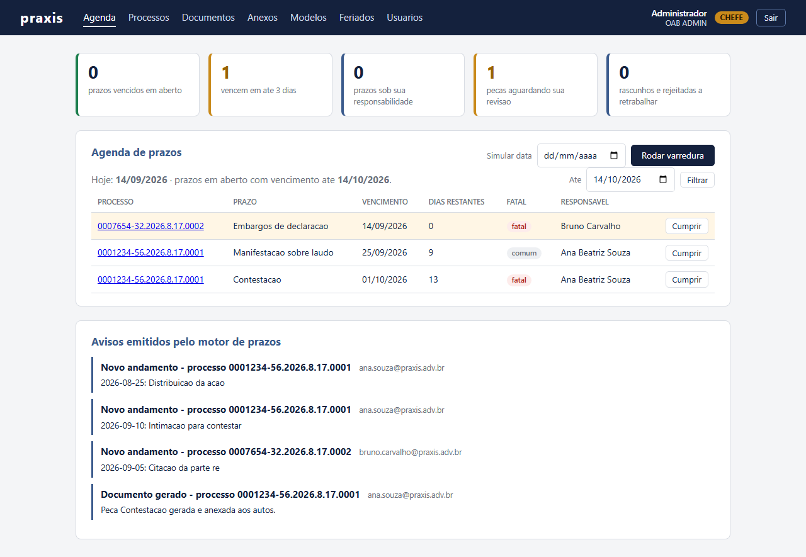 |
| **Processos** — busca, cadastro com responsável escolhido entre os usuários 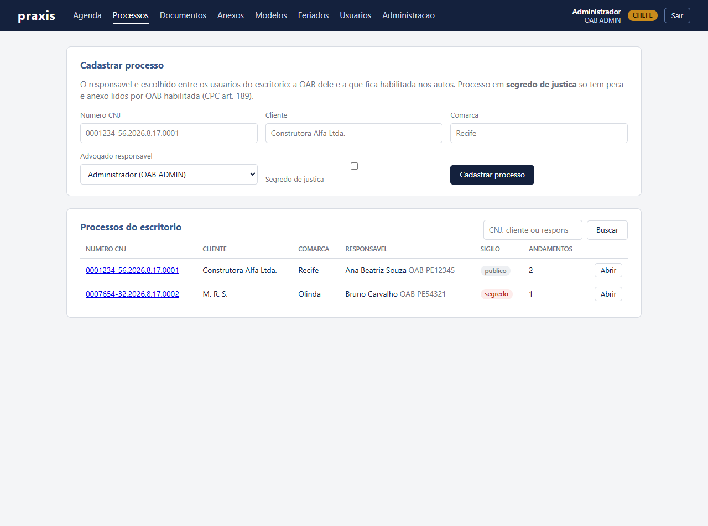 | **Ficha do processo** — linha do tempo, prazos, peças, anexos; registrar andamento e abrir prazo 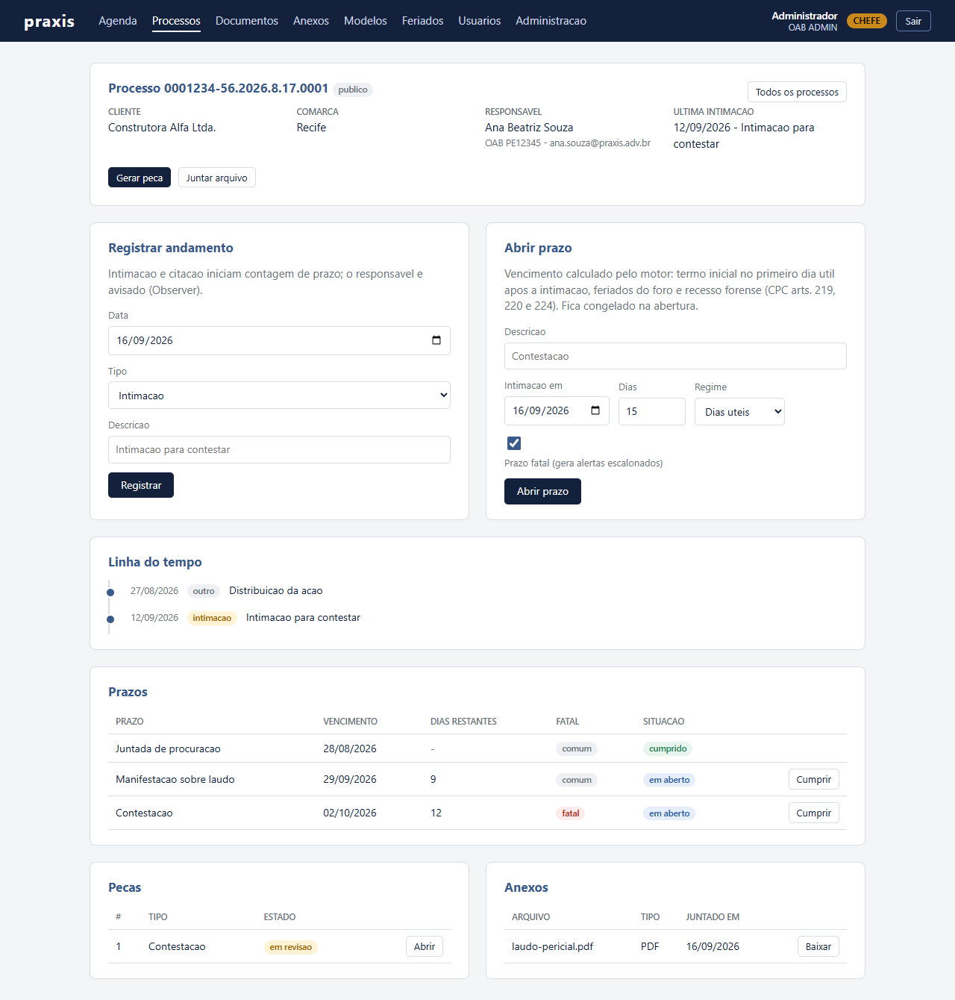 |
| **Gerar peça** — escolhido um modelo, um campo por marcador `{{…}}` 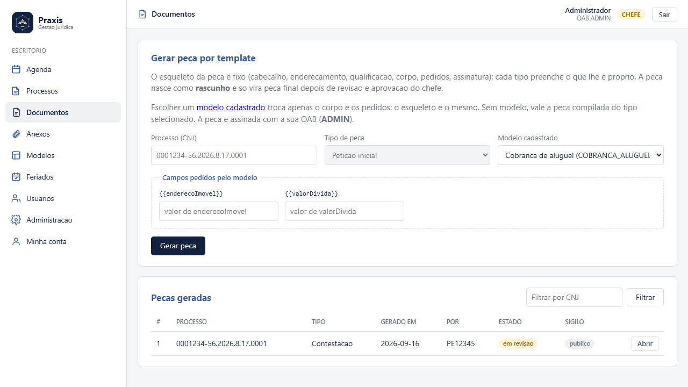 | **Revisão da peça** — chefe aprova/rejeita, habilita OAB, vê o histórico 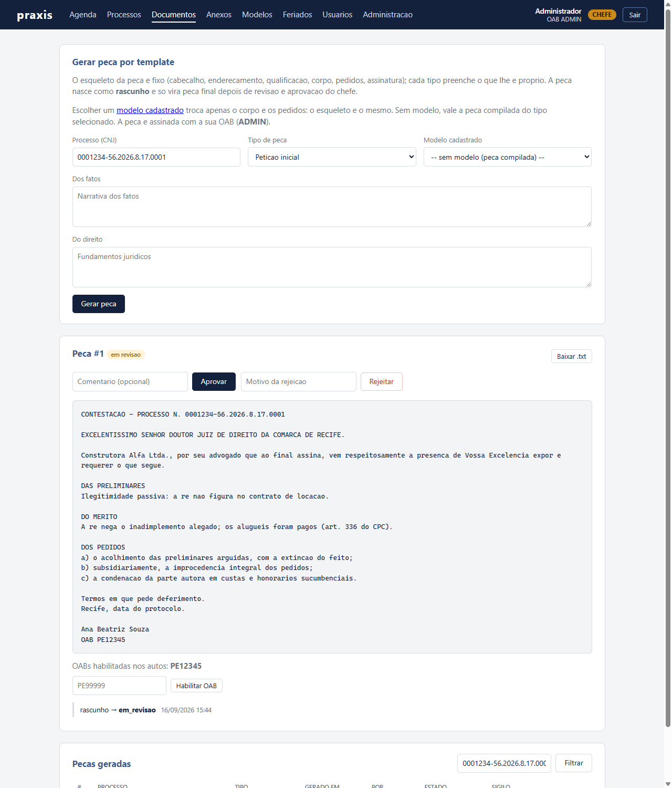 |
| **Modelos** — corpo e pedidos com `{{campos}}`; os que serão pedidos aparecem enquanto digita 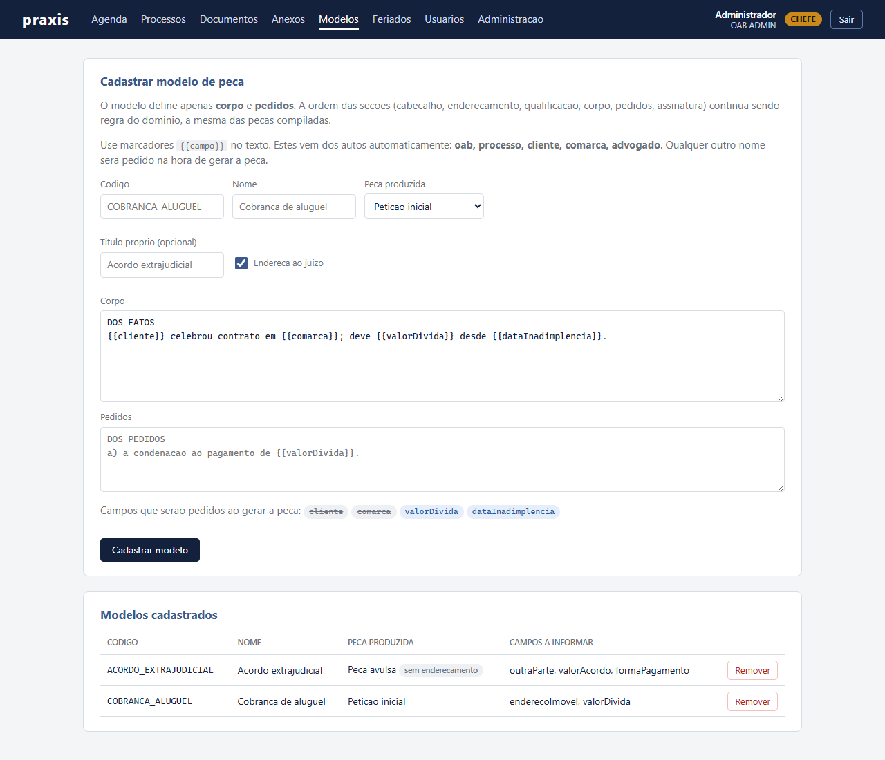 | **Feriados** — data única ou anual; nacional, estadual ou da comarca; "corre prazo em…" 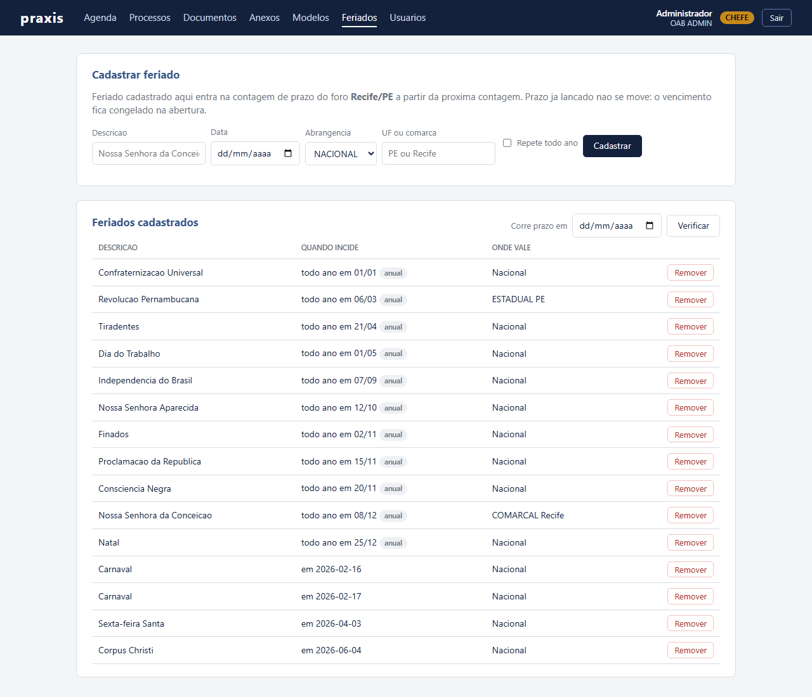 |
| **Anexos** — juntada com a OAB da sessão; download passa pelo Proxy 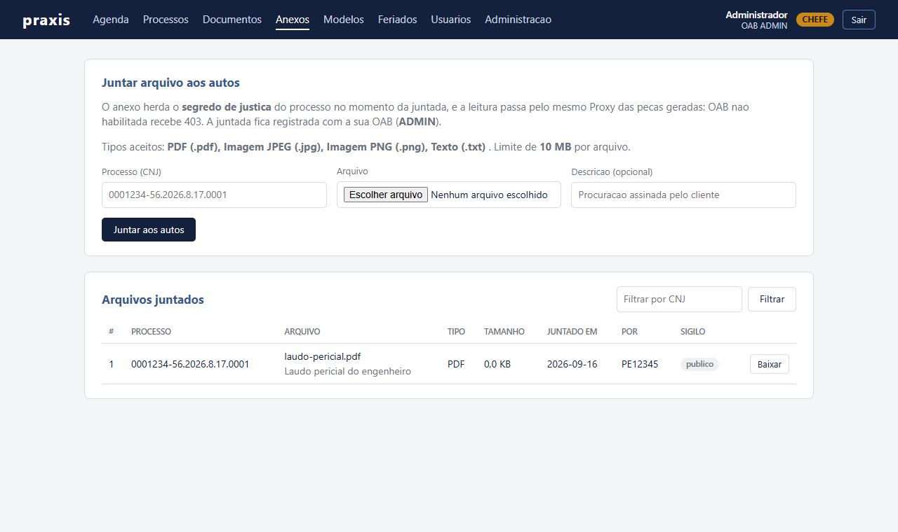 | **Segredo de justiça** — advogada sem OAB habilitada é avisada; peça e anexo respondem 403 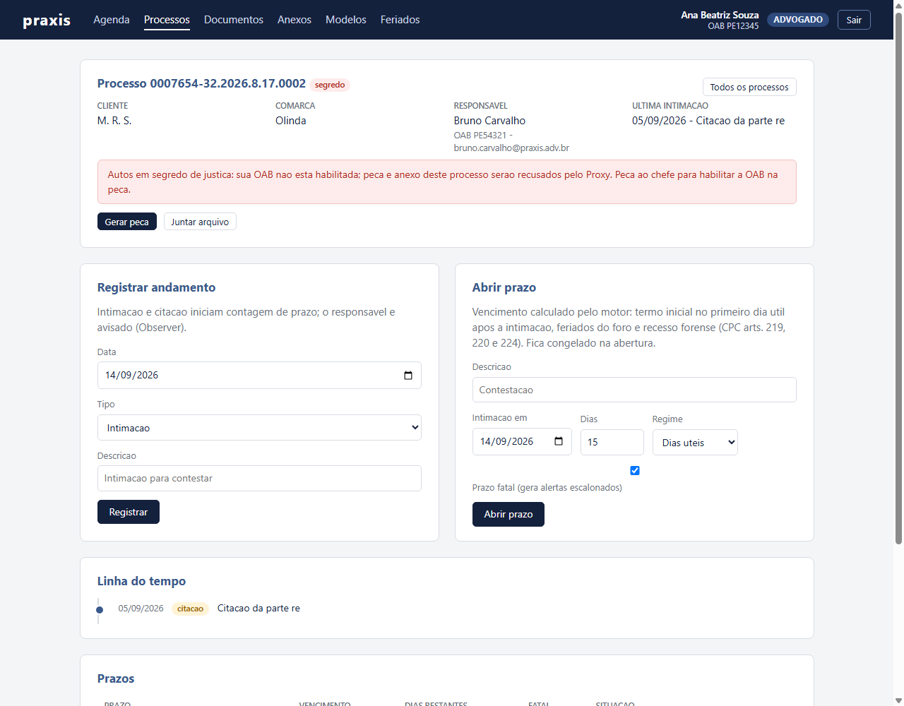 |
| **Usuários** (chefe) — cadastro com senha provisória, papel, remoção protegida 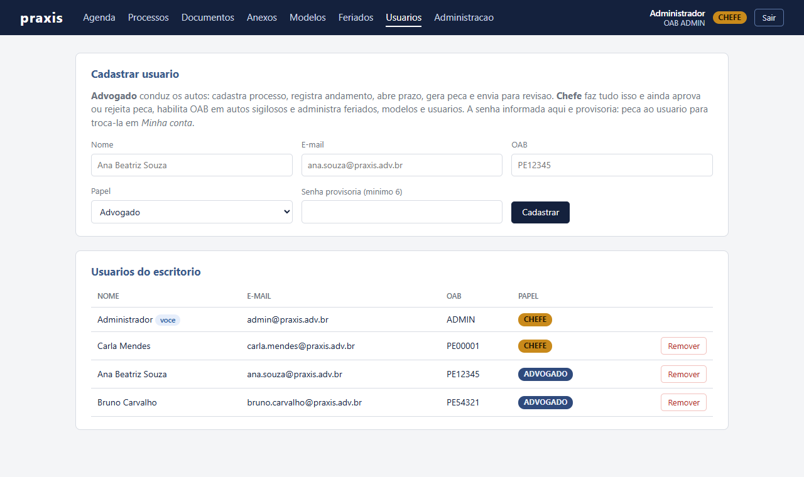 | **Minha conta** — troca de senha exigindo a atual 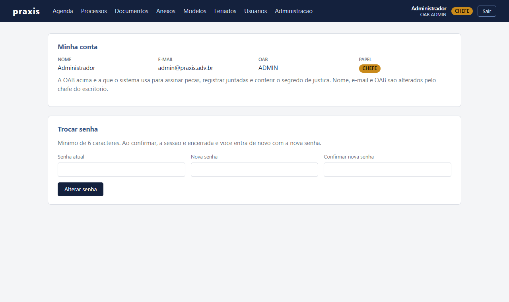 |
| **Administração** (chefe) — contadores, o que exige atenção, atalhos e ficha da instância 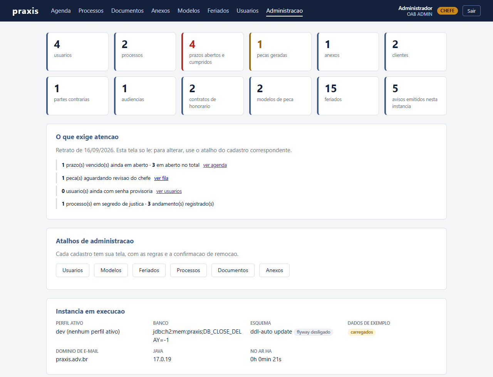 | **Administração** — cadastros do escritório: usuários, processos, prazos (com os cumpridos), peças, anexos 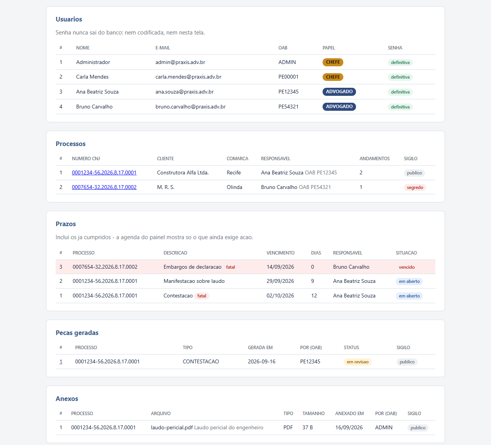 |

## Regras de negócio

Consolidação das regras que o domínio faz cumprir (cada uma tem teste de unidade ou cenário BDD). Artigos citados são do CPC/2015.

**Processo e andamentos**
- Processo tem número **CNJ** válido (`NNNNNNN-DD.AAAA.J.TR.OOOO`), cliente, comarca e **um advogado responsável** (nome, e-mail, OAB); número é único.
- Pode nascer em **segredo de justiça** (art. 189): a OAB do responsável fica habilitada nos autos; qualquer outra precisa ser habilitada pelo chefe.
- Andamento tem data, descrição e tipo (intimação, citação, audiência, despacho, sentença, juntada, outro). A linha do tempo é sempre **cronológica**, independente da ordem de registro.
- **Intimação e citação** são os andamentos que iniciam contagem de prazo; registrar andamento avisa o responsável.

**Prazos (motor de prazos)**
- Prazo tem descrição, data da intimação, quantidade de dias (≥ 1), regime e é **fatal** ou comum; o responsável é o do processo.
- Regime **dias úteis** (art. 219, regra para prazos processuais) ou **dias corridos** (prazos materiais).
- **Termo inicial**: o primeiro dia útil seguinte à intimação (art. 224); o vencimento cai no último dia da contagem e, se for dia sem expediente, prorroga para o próximo útil.
- Não contam como dia útil: **fim de semana**, **feriados** do calendário que valem para o foro (nacional, da UF ou da comarca) e o **recesso forense de 20/12 a 20/01** (art. 220). Fim de semana e recesso são regra de lei, não cadastráveis.
- O vencimento é **calculado e congelado na abertura**: cadastrar ou remover feriado depois não move prazo já lançado.
- Alertas por dias contáveis restantes: `ATENCAO` (≤ 5), `URGENTE` (≤ 3), `CRITICO` (≤ 1), `VENCE_HOJE` (0) e `VENCIDO` (em aberto após o vencimento). Sempre o mais severo aplicável.
- **Idempotência por marco**: cada nível é avisado uma única vez por prazo — rodar a varredura duas vezes no dia não repete aviso.
- Política padrão do escritório: **só prazo fatal gera alerta**; prazo comum entra na agenda mas não dispara aviso (política "inclusiva" existe para quem quiser).
- Prazo **cumprido** sai da varredura e não pode ser cumprido de novo.
- A varredura roda todo dia útil às 7h e também sob demanda, pelo mesmo caso de uso; notificação segue para painel, e-mail (log) e trilha de auditoria em banco.

**Peças (geração de documentos)**
- Toda peça tem o mesmo **esqueleto**: cabeçalho, endereçamento, qualificação, corpo, pedidos e assinatura com nome e OAB do responsável. A ordem é regra do domínio e não pode ser alterada por modelo.
- Tipos compilados: **petição inicial** (fatos, direito), **contestação** (preliminares, mérito) e **procuração ad judicia** (poderes especiais; não se endereça ao juízo). **Peça avulsa** é o tipo dos modelos que não são nenhum dos três.
- A peça **herda o segredo de justiça** do processo e a lista de OABs habilitadas no momento da geração; a OAB de quem gerou entra na lista.
- Leitura de peça sigilosa só por **OAB habilitada** — na tela (OAB da sessão) e na API (`403`). Peça sigilosa exige ao menos uma OAB habilitada; não se revoga a última.
- O tipo da peça registrada vem do **gerador** (modelo ou compilado), não do que o usuário pediu.
- Gerar peça avisa o advogado responsável.

**Fluxo de aprovação da peça**
- Estados: `RASCUNHO → EM_REVISAO → APROVADO | REJEITADO → (APROVADO) PROTOCOLADO`.
- Só rascunho ou rejeitada vai para revisão; só em revisão pode ser aprovada ou rejeitada; só aprovada pode ser protocolada; protocolada não muda mais.
- **Aprovar, rejeitar e desfazer decisão são do chefe**; aprovação exige OAB do aprovador; rejeição exige motivo.
- Desfazer volta a peça para `EM_REVISAO` e fica no histórico; toda transição registra de/para, OAB e comentário.
- Transição inválida é erro do cliente (`409`), nunca do servidor.

**Modelos de peça**
- Modelo tem código único (maiúsculas/underscore), nome, tipo de peça produzida, título opcional, **corpo e pedidos** com marcadores `{{campo}}`, e diz se **endereça ao juízo**.
- Marcadores reservados vêm dos autos: `cliente`, `comarca`, `processo`, `advogado`, `oab`. Qualquer outro é **pedido ao gerar** a peça; o cadastro informa quais.
- Campo não informado vira marcador visível na peça — `(valorDivida a preencher)` — nunca lacuna silenciosa.
- Modelo que não endereça ao juízo dispensa endereçamento, qualificação e fecho de uma vez.
- Editar ou remover modelo não altera peça já gerada (a peça persiste o próprio texto). Remover modelo é ação do chefe.

**Anexos**
- Aceitos: **PDF, JPEG, PNG e texto**, até **10 MB**; tipo é conferido pelo `Content-Type` e a extensão correta é garantida no nome.
- O nome do arquivo é saneado: caminho de diretório (`../`) é descartado.
- O anexo **copia** segredo de justiça e OABs habilitadas do processo **no momento da juntada**; a leitura passa pelo mesmo Proxy das peças.
- Não existe remoção de anexo: documento juntado aos autos não se desanexa (desentranhamento é decisão judicial).
- Juntada avisa o responsável.

**Feriados e calendário**
- Feriado tem descrição, **recorrência** (data única ou anual fixa) e **abrangência** (nacional, estadual com UF, comarcal com comarca).
- Só entram na contagem os feriados que valem para o **foro do escritório** (`praxis.foro.uf` / `comarca`): feriado de Olinda não suspende prazo em Recife.
- Feriado cadastrado vale na **próxima contagem**, sem reiniciar. Remover feriado é ação do chefe.

**Honorários**
- Contrato por processo em uma de três modalidades: **fixo**, **por hora** (valor × horas) ou **quota litis** (percentual sobre o valor da causa).
- Quota litis acima de **30 %** é recusada (limite ético do Código de Ética da OAB).

**Audiências, clientes e partes contrárias**
- Audiência tem processo, parte autora, início, fim (posterior ao início) e sala; **duas audiências não se sobrepõem na mesma sala**; edição respeita a mesma regra e conflitos podem ser consultados antes de gravar.
- Cliente (pessoa física ou jurídica) tem CPF/CNPJ **único**; exclusão é lógica (inativa) e reativação é possível; edição é parcial (campo omitido mantém o valor).
- Parte contrária segue o mesmo modelo, sem unicidade de documento.

**Acesso**
- Todo o painel exige login; dois papéis: **advogado** (conduz os autos) e **chefe** (tudo do advogado + aprovar peça, habilitar OAB, remover feriado/modelo, gerir usuários).
- E-mail e OAB são **únicos**; senha mínima de 6 caracteres pela tela; usuário criado pelo chefe entra com **senha provisória** e só libera o painel depois de trocá-la.
- Ninguém remove a si mesmo, e o escritório precisa de **ao menos um chefe**.
- 5 falhas de login seguidas bloqueiam o e-mail por 1 minuto; e-mail desconhecido e senha errada recebem a mesma resposta.

**Stack:** Java 17 · Spring Boot 4.1.1 (WebMVC, Data JPA, Validation, Thymeleaf) · H2 (dev/test) · PostgreSQL + Flyway (prod) · JUnit 5 · Cucumber 7 · Maven Wrapper.

## Como rodar

```bash
./mvnw test            # 161 testes: unidade + contrato HTTP + 53 cenários BDD (481 steps)
./mvnw spring-boot:run # sobe em http://localhost:8080
```

- Interface web: <http://localhost:8080/painel> (pede login; veja [Acesso ao painel](#acesso-ao-painel-advogados-e-chefes))
- Console do banco: <http://localhost:8080/h2-console> (`jdbc:h2:mem:praxis`, usuário `sa`, sem senha)
- A aplicação sobe com carga de exemplo (dois processos, um deles em segredo de justiça, e três prazos em estados diferentes). Desligue com `praxis.dados-exemplo=false`.
- O calendário nasce com os feriados nacionais, mais um estadual e um comarcal de exemplo. Desligue com `praxis.feriados-iniciais=false`.
- O foro do escritório define quais feriados estaduais e comarcais contam: `praxis.foro.uf=PE` e `praxis.foro.comarca=Recife`.

### Produção: PostgreSQL + Flyway

```bash
SPRING_PROFILES_ACTIVE=prod PRAXIS_DB_URL=jdbc:postgresql://localhost:5432/praxis PRAXIS_DB_USER=praxis PRAXIS_DB_PASSWORD=segredo PRAXIS_SENHA_INICIAL=troque-ja ./mvnw spring-boot:run
```

- O esquema é versionado em [`src/main/resources/db/migration`](src/main/resources/db/migration) (`V1__esquema_inicial.sql`); o Hibernate roda com `ddl-auto=validate`, então toda mudança de entidade exige uma nova `V{n}__*.sql`.
- Em dev/test o Flyway fica desligado e o H2 em memória segue com `ddl-auto=update`. `MigracaoFlywayTest` sobe a aplicação com H2 em modo PostgreSQL, aplica a migração e deixa o Hibernate validar — migração e entidades não divergem sem um teste quebrar.
- Binário e texto longo são `bytea`/`text` (colunas comuns), não large objects (`oid`): entram em backup e transação como qualquer coluna.
- No perfil prod os usuários iniciais nascem com **senha provisória** (`praxis.exigir-troca-senha-inicial=true`): o primeiro acesso cai na troca de senha; a carga de exemplo não roda; cookie de sessão `Secure`.

## Funcionalidades implementadas nesta entrega

### 1. Motor de prazos processuais com alertas (complexidade alta)

- Contagem legal em **dias úteis** (CPC art. 219) ou **dias corridos**, com termo inicial no primeiro dia útil seguinte à intimação (art. 224), feriados e **recesso forense** de 20/12 a 20/01 (art. 220).
- Vencimento **congelado** na abertura do prazo: alterar o calendário depois não move prazo já lançado.
- Alerta **escalonado** por dias contáveis restantes: `ATENCAO` (≤5), `URGENTE` (≤3), `CRITICO` (≤1), `VENCE_HOJE` (0) e `VENCIDO` (em aberto após o vencimento, aviso de perda) — sempre o nível mais severo aplicável.
- **Idempotência por marco**: cada nível é notificado uma única vez por prazo, então rodar a varredura duas vezes no mesmo dia não gera aviso repetido.
- Varredura automática todo dia útil às 7h (`@Scheduled`) e endpoint manual que chama **o mesmo caso de uso**.
- Notificação entregue por cadeia de canais (painel, e-mail, trilha de auditoria em banco).
- Cumprimento de prazo retira o item da varredura.

### 2. Geração de documentos por template (complexidade alta)

- Petição inicial, contestação e procuração a partir de template com esqueleto fixo.
- Peça gerada é persistida, listada por processo e baixável em texto.
- Documento herda o **segredo de justiça** do processo e a lista de OABs habilitadas nos autos; leitura por OAB não habilitada é bloqueada (CPC art. 189) — verificado também via HTTP (`403`).
- Geração avisa o advogado responsável.

### 3. Cadastro de feriados

- Feriado com **data única** (ponto facultativo de um ano só) ou **recorrência anual fixa** (Natal, Tiradentes), escolhido por Strategy.
- **Abrangência** nacional, estadual (UF) ou da comarca: feriado de Olinda não suspende prazo que corre em Recife.
- O calendário forense passou a ser montado sobre o cadastro, e não sobre lista fixa no código: **feriado cadastrado vale na contagem seguinte, sem reiniciar** a aplicação.
- Prazo **já lançado não se move**, porque o vencimento fica congelado na abertura — verificado em cenário BDD.
- Fim de semana e recesso forense (art. 220) continuam no código, como regras de lei que o usuário não pode apagar por engano.
- Carga de referência com os feriados nacionais na subida, mais um exemplo estadual (PE) e um comarcal (Recife).

### 4. Cadastro de modelos de documento

- O escritório cadastra **corpo** e **pedidos** com marcadores `{{campo}}`, e passa a gerar peça nova **sem alterar código**.
- Modelo cadastrado **coexiste** com as peças compiladas: `GeradorPorModelo` é mais uma subclasse do Template Method, então `gerar()` segue `final` e a ordem das seções continua sendo regra do domínio, não escolha do usuário.
- Marcadores resolvidos por **Interpreter**: `cliente`, `comarca`, `processo`, `advogado` e `oab` vêm dos autos automaticamente; os demais são cobrados na geração e o cadastro informa **quais campos cada modelo espera**.
- Campo não informado vira marcador visível na peça (`(valorDivida a preencher)`) em vez de lacuna silenciosa.
- Modelo que **não se endereça ao juízo** abandona as três seções do juízo de uma vez (endereçamento, qualificação e fecho), como a `Procuracao` faz — só que decidido pelo cadastro.
- O `TipoDocumento` da peça registrada nos autos vem do **modelo**, não do pedido. `PECA_AVULSA` existe para o que não é petição, contestação nem procuração.
- Editar modelo não altera peça já gerada, porque o documento persiste o próprio conteúdo.
- Sobe com dois modelos de exemplo (`COBRANCA_ALUGUEL` e `ACORDO_EXTRAJUDICIAL`). Desligue com `praxis.modelos-iniciais=false`.

### 5. Upload e anexação de arquivos ao processo

- Arquivo recebido de fora (procuração assinada, comprovante, laudo) é juntado aos autos e guardado **no banco**, em BLOB.
- **Agregado próprio** (`ArquivoAnexo`), e não um documento gerado com bytes: a peça nasce de template e tem seções; o anexo é binário opaco, com nome original, tipo e tamanho.
- O que os dois têm em comum é só a **regra de acesso**, extraída em `ConteudoRestrito`: o mesmo Proxy do segredo de justiça protege peça gerada e anexo, sem duplicar a checagem do art. 189.
- O anexo copia segredo de justiça e OABs habilitadas do processo **no momento da juntada** — anexo juntado quando os autos eram públicos não passa a ser sigiloso depois.
- Tipos aceitos são uma lista curta (PDF, JPEG, PNG, texto) e o limite é de 10 MB: autos eletrônicos não recebem binário qualquer, e recusar na porta evita anexo que o juízo não abre.
- O nome vem do computador de quem envia, então **não é confiável**: caminho de diretório é descartado (bloqueia `../`) e a extensão do tipo aceito é garantida.
- Juntada avisa o advogado responsável, pelo mesmo Observer dos demais eventos.
- Não existe caso de uso de remoção: documento juntado aos autos não se desanexa — retirar peça depende de decisão judicial (desentranhamento), que não é operação de tela.

### 6. Acesso ao painel: advogados e chefes

- Todo o painel (`/painel/**`) exige **login por e-mail e senha**; a sessão HTTP guarda só uma projeção do usuário (nome, OAB e papel), nunca a senha.
- Dois **papéis**: `ADVOGADO` conduz os autos (gera peça, envia para revisão, protocola, junta anexo, cadastra feriado e modelo); `CHEFE` (sócio/coordenador) faz tudo isso e ainda **aprova, rejeita e desfaz decisão** sobre peça, **habilita OAB** em peça sigilosa e **remove** feriado e modelo.
- A **OAB do solicitante deixou de ser digitada nas telas**: sai da sessão. O Proxy de segredo de justiça passa a conferir quem realmente está logado.
- Ação do chefe é marcada com `@SomenteChefe` e barrada pelo `SessaoInterceptor` com `403`, mesmo que o advogado monte o POST na mão; a tela apenas esconde o botão.
- Senha protegida com **PBKDF2-HMAC-SHA256** (sal por usuário, 120 mil iterações) do próprio JDK, atrás da porta de domínio `CodificadorDeSenha` — o agregado `Usuario` não sabe o algoritmo.
- E-mail desconhecido e senha errada recebem a **mesma mensagem**, para não revelar quem tem conta; destino pós-login só aceita caminho interno do painel; a sessão é recriada ao autenticar (evita fixação).
- A **API REST continua aberta** e recebendo a OAB na requisição, como antes — é o contrato dos testes HTTP e dos scripts abaixo.
- O **fluxo de aprovação** de peça (rascunho → em revisão → aprovado/rejeitado → protocolado), antes só na API, agora está na tela de documentos, com histórico de transições.
- **Gestão de usuários** pela tela (`/painel/usuarios`, chefe): cadastrar com senha provisória e remover — nunca a si mesmo nem o último chefe. **Minha conta** (`/painel/conta`): troca de senha exigindo a atual; a sessão é encerrada para entrar de novo.
- **Freio de força bruta** no login: 5 falhas seguidas para o mesmo e-mail bloqueiam aquele e-mail por 1 minuto.
- **CSRF**: todo POST do painel (e o `/sair`) leva um token sincronizado com a sessão (`_csrf` hidden ou cabeçalho `X-CSRF-Token`); sem ele, `403`. Sessão só por cookie (`HttpOnly`, `SameSite=Lax`, sem `;jsessionid` em URL).
- **Cabeçalhos de segurança** em toda resposta: `Content-Security-Policy` (`script-src 'self'`, `frame-ancestors 'none'`), `X-Frame-Options: DENY`, `X-Content-Type-Options: nosniff`, `Referrer-Policy`, e `Cache-Control: no-store` nas páginas autenticadas. Por isso as telas não têm JavaScript inline: o comportamento (confirmações, anti-duplo-clique) está em `/js/praxis.js` via atributos `data-*`.
- **Senha provisória**: usuário cadastrado pelo chefe entra e só consegue abrir *Minha conta* até trocar a senha; ao trocar, a flag cai.
- **Tela de processos** (`/painel/processos`): cadastrar processo escolhendo o responsável entre os usuários, ficha com linha do tempo (Iterator), prazos, peças e anexos; registrar andamento e abrir prazo pela tela — antes só via API.
- **Resumo do dia** no painel: prazos vencidos, críticos, sob sua responsabilidade, peças aguardando revisão e rascunhos a retrabalhar.
- **Administração** (`/painel/admin`, chefe): o escritório inteiro em uma tela, detalhada em [7. Administração](#7-administração-o-escritório-inteiro-em-uma-tela).

#### Acesso ao painel (advogados e chefes)

A aplicação sobe com três usuários (desligue com `praxis.usuarios-iniciais=false`; a senha inicial é `praxis.senha-inicial`, padrão `praxis123` — troque em produção):

| Papel | Nome | E-mail | OAB |
|---|---|---|---|
| Chefe (admin) | Administrador | `admin` (ou `admin@praxis.adv.br`), senha `123` — `praxis.admin.*`; em prod só existe com `PRAXIS_ADMIN_SENHA` | ADMIN |
| Chefe | Carla Mendes | `carla.mendes@praxis.adv.br` | PE00001 |
| Advogado | Ana Beatriz Souza | `ana.souza@praxis.adv.br` | PE12345 (responsável pelo processo público de exemplo) |
| Advogado | Bruno Carvalho | `bruno.carvalho@praxis.adv.br` | PE54321 (responsável pelo processo em segredo de justiça) |

No login basta o nome do usuário (`admin`, `ana.souza`): sem `@`, o domínio `praxis.dominio-email` é completado. Entre como Bruno para ler a peça sigilosa; como Ana, o Proxy recusa. Entre como Carla (ou admin) para aprovar a peça que Ana enviou para revisão.

Funcionalidades de apoio já no repositório: cadastro de processo, registro de andamento com linha do tempo cronológica, e cálculo de honorários (fixo, por hora, quota litis com limite ético de 30%).

### 7. Administração: o escritório inteiro em uma tela

`/painel/admin`, reservada ao chefe. Antes dela, saber o que o sistema guardava exigia passar por seis telas — e três cadastros (cliente, parte contrária e audiência) **não tinham tela nenhuma**, só a API REST. A tela resolve isso com uma consulta só.

**O que ela mostra**

- **Contadores** de doze cadastros no topo, cada um ancorado na sua tabela. Os que exigem ação mudam de cor: prazo vencido fica vermelho, peça aguardando revisão e usuário com senha provisória ficam âmbar.
- **O que exige atenção**: prazos vencidos em aberto, peças na fila de revisão, usuários que ainda não trocaram a senha provisória, processos em segredo de justiça e o total de andamentos registrados.
- **Tabelas completas**: usuários, processos, prazos, peças geradas, anexos, clientes, partes contrárias, audiências, contratos de honorário, modelos, feriados e os avisos emitidos pelo notificador de painel.
- **Ficha da instância** em execução: perfil ativo, URL do banco, `ddl-auto`, Flyway ligado ou não, dados de exemplo, domínio de e-mail, versão do Java e tempo no ar. É diagnóstico — responde "qual banco esta instância está usando?" sem abrir o terminal.
- **Atalhos** para as telas onde se cadastra e se remove.


Depois do topo vêm as tabelas, uma seção por cadastro. Os prazos trazem os já cumpridos (etiqueta verde), que a agenda do dia esconde, e os vencidos em aberto aparecem com a linha em vermelho:


Os três cadastros que não têm tela própria — cliente, parte contrária e audiência — aparecem aqui com os desativados juntos, marcados pela etiqueta de situação:

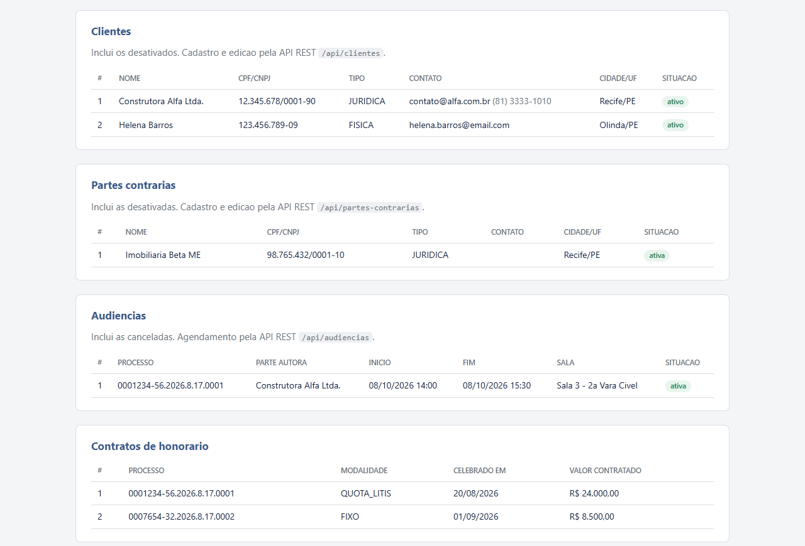

No fim, o que sustenta o resto: modelos de peça, o calendário forense que alimenta a contagem de prazos e a fila de avisos emitidos por esta instância.

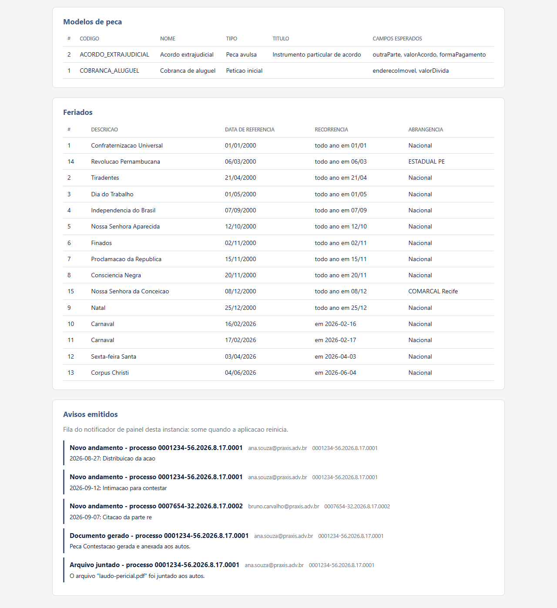

**Três decisões que valem a defesa**

- **A tela só lê.** Criar e remover continua em cada cadastro, que é onde a regra vive: remover usuário não pode deixar o escritório sem chefe, remover feriado muda a contagem de prazo de todo mundo. Duplicar esses formulários aqui duplicaria a regra — ou, pior, deixaria uma cópia sem ela.
- **Consulta própria, em vez de reaproveitar as do dia a dia.** As listagens existentes servem à tela do dia e por isso escondem o que já saiu de cena: a agenda só devolve prazo em aberto (`cumprido = false`) e cliente, parte contrária e audiência filtram os ativos. Mudar esses métodos para trazer tudo estragaria as telas que dependem deles. Foram criadas operações novas — `PrazosUseCases.ListarTodosOsPrazos`, `listarTodosOsClientes()`, `listarTodasAsPartesContrarias()`, `listarTodasAsAudiencias()` — e as antigas ficaram como estavam.
- **`ConsultarPanorama` não fala com repositório.** O `PanoramaAppService` compõe os casos de uso de listagem que já existem; nenhuma consulta nova desce à persistência por fora das portas. Assim a tela não vira um segundo caminho até o banco, com regra de leitura própria.

**O que ela não deixa vazar**

- `@SomenteChefe` na classe: advogado que montar a URL na mão recebe `403` do `SessaoInterceptor`. Esconder o link no menu é conforto, não proteção — e o teste cobre os dois.
- A senha codificada não entra no panorama, então não chega ao HTML (`AdminHttpTest` falha se chegar).
- A URL do banco é mostrada sem a parte de parâmetros, que em alguns drivers carrega credencial. Usuário e senha do banco nunca aparecem.

## Arquitetura limpa

```
presentation/   REST (/api/**) e web Thymeleaf (/painel/**, login e guarda de sessão) — só traduz HTTP em caso de uso
application/    port/in (casos de uso), port/out (repositórios), usecase (orquestração)
domain/         processo, prazo, documento, modelo, anexo, feriado, notificacao, honorario, usuario, compartilhado — Java puro
infrastructure/ persistence (JPA + mappers + adapters), notificacao, scheduler, seguranca (PBKDF2), config
```

Regra de dependência: **nada no `domain` importa Spring ou JPA**. As entidades JPA vivem em `infrastructure.persistence.entity` e o `PersistenciaMapper` traduz nos dois sentidos; quem instancia e liga as classes de domínio é `infrastructure.config.DominioConfig`.

## DDD nos quatro níveis

| Nível | Onde está |
|---|---|
| Preliminar | [`docs/dominio.md`](docs/dominio.md) — problema, e por que estas duas funcionalidades primeiro |
| Estratégico | 4 subdomínios / bounded contexts e suas relações — [`docs/praxis.cml`](docs/praxis.cml) (Context Mapper) |
| Tático | Agregados `Processo`, `Prazo`, `DocumentoGerado`, `Feriado`, `ModeloDocumento`, `ArquivoAnexo`, `Usuario`; VOs `NumeroCnj`, `Advogado`, `AlertaPrazo`, `BaseCalculo`, `Abrangencia`, `Jurisdicao`, `CodigoModelo`, `TextoModelo`; núcleo compartilhado `ConteudoRestrito`; serviços `MotorDePrazos`, `CalendarioForense`; eventos em `EventoProcesso` |
| Operacional | Casos de uso em `application.usecase`, job de varredura, endpoints REST e telas |

Linguagem onipresente preservada no código: processo, andamento, intimação, citação, prazo fatal, termo inicial, dias úteis, recesso forense, cumprir, peça, endereçamento, qualificação, procuração ad judicia, segredo de justiça, OAB habilitada, quota litis, feriado, abrangência, comarca, foro.

## Padrões de projeto (os 6 da lista do enunciado, mais Composite e Interpreter)

| Padrão | Onde | Problema real que resolve |
|---|---|---|
| **Strategy** | `ContagemPrazoStrategy` → `ContagemDiasUteis` / `ContagemDiasCorridos`; `CalculoHonorarioStrategy` → fixo / hora / quota litis; `RegraRecorrencia` → `DataUnica` / `RecorrenciaAnualFixa` | A lei define regimes distintos de contagem e de cobrança; o agregado não deve saber qual está em vigor. No feriado, separa *quando incide* de *onde vale* |
| **Composite** | `RegraDiaNaoUtil` → `FimDeSemana`, `RecessoForense`, `FeriadosFixos`, `FeriadosDoForo`, combinadas por `CalendarioForense` | Cada motivo de suspensão do expediente é independente; o calendário combina todos sem saber quantos são, e a origem dos feriados (constante em teste, cadastro em banco em produção) troca sem tocar no calendário |
| **Template Method** | `GeradorDocumento` → `PeticaoInicial`, `Contestacao`, `Procuracao`, `GeradorPorModelo` | A ordem das seções da peça é regra do domínio (`gerar()` é `final`); só corpo e pedidos mudam. `Procuracao` sobrescreve os hooks porque não se endereça ao juízo, e `GeradorPorModelo` lê os mesmos dois passos de um modelo cadastrado — é o que deixa a peça ser cadastrável sem abrir mão do padrão |
| **Interpreter** | `ExpressaoTexto` → `Literal` / `ReferenciaCampo`, montadas por `TextoModelo` e avaliadas contra `ContextoTexto` | O texto do modelo é uma linguagem mínima (trecho fixo + referência a campo); cada termo sabe se interpretar, então o modelo não faz varredura de string a cada geração nem precisa saber quais campos existem |
| **Observer** | `Processo` e `MotorDePrazos` publicam `EventoProcesso`; `AdvogadoResponsavel` observa | Novo andamento e prazo em risco precisam avisar o responsável sem o agregado conhecer e-mail nem banco |
| **Decorator** | `NotificadorPainel` decorado por `NotificadorEmail` e `NotificadorAuditoria` | Canais e trilha de auditoria empilháveis sobre a notificação base, sem `if` de canal |
| **Proxy** | `ProxyDeAcesso` sobre `ConteudoRestrito`, especializado em `DocumentoProxy` e `ArquivoProxy` | Segredo de justiça conferido antes de o conteúdo sair da persistência; impossível esquecer a checagem, porque o caso de uso só tem acesso ao Proxy. A regra do art. 189 é escrita uma vez e vale para peça gerada e arquivo anexado |
| **Iterator** | `Processo implements Iterable<Andamento>` | Linha do tempo em ordem cronológica sem expor a coleção interna |

## BDD

Cenários em português em [`src/test/resources/features`](src/test/resources/features), automatizados com Cucumber + Spring (`src/test/java/school/cesar/praxis/bdd`). Os steps exercitam os casos de uso reais contra o banco, não dublês.

> **Dado** um processo com prazo fatal em 5 dias úteis, **quando** faltarem 3 dias, **então** o advogado responsável deve ser notificado.

```
53 scenarios (53 passed)
481 steps (481 passed)
Tests run: 161, Failures: 0, Errors: 0
```

Os cenários chamam os casos de uso, então não cobrem o corpo da requisição dos controllers. `ModeloHttpTest`, `AnexoHttpTest` e `LoginHttpTest` fecham essa lacuna pelo mesmo caminho do navegador (MockMvc) — foi assim que apareceram um `codigoModelo` faltando no `record` de requisição e um `500` onde devia haver `400`, ambos invisíveis para o BDD.

## Endpoints

```
POST /api/processos                            cadastra processo + responsável
POST /api/processos/{numero}/andamentos        registra andamento (dispara Observer)
GET  /api/processos/{numero}/linha-do-tempo    timeline cronológica (Iterator)

POST /api/prazos                               abre prazo (calcula vencimento pela Strategy)
GET  /api/prazos/agenda?ate=YYYY-MM-DD         agenda ordenada por vencimento
POST /api/prazos/{id}/cumprir                  registra cumprimento
POST /api/prazos/varredura?hoje=YYYY-MM-DD     roda o motor de prazos

POST /api/documentos                           gera peça (campo codigoModelo opcional escolhe o modelo)
GET  /api/documentos?processo=                 lista peças
GET  /api/documentos/{id}?oab=                 baixa a peça (passa pelo Proxy; 403 se não habilitada)

POST   /api/modelos                            cadastra modelo de peça (corpo e pedidos com {{campo}})
GET    /api/modelos                            lista modelos e os campos que cada um espera
DELETE /api/modelos/{id}                       remove modelo

POST /api/anexos                               junta arquivo aos autos (multipart)
GET  /api/anexos?processo=                     lista anexos (sem os bytes)
GET  /api/anexos/{id}?oab=                     baixa o arquivo (passa pelo Proxy; 403 se não habilitada)

POST   /api/feriados                           cadastra feriado (data única ou anual; nacional/estadual/comarcal)
GET    /api/feriados                           lista o calendário cadastrado
DELETE /api/feriados/{id}                      remove feriado
GET    /api/feriados/dia-util?data=YYYY-MM-DD  corre prazo neste dia? (efeito do cadastro no motor)

POST /api/documentos/{id}/enviar-revisao       rascunho -> em revisão
POST /api/documentos/{id}/aprovar              {texto}   em revisão -> aprovado  (chefe)
POST /api/documentos/{id}/rejeitar             {texto}   em revisão -> rejeitado (chefe)
POST /api/documentos/{id}/desfazer             desfaz a última decisão (chefe)
POST /api/documentos/{id}/protocolar           aprovado -> protocolado
POST /api/documentos/{id}/oabs                 {oab}  habilita OAB nos autos da peça (chefe)
```

**Leitura é aberta; mutação exige a sessão do painel.** `GET`, `HEAD`, `OPTIONS` e
`TRACE` em `/api/**` passam sem autenticar. Todo `POST`, `PUT`, `PATCH` e `DELETE`
passa pelo `SessaoApiInterceptor`: sem sessão é `401`, sem o token CSRF (parâmetro
`_csrf` ou cabeçalho `X-CSRF-Token`) é `403`, senha provisória é `403` e ação de
chefe pedida por advogado é `403`. A recusa sai como `{"erro": ...}` — nunca um
redirect para `/login`, que um script leria como sucesso.

A OAB de quem age **vem sempre da sessão**, nunca do corpo: gerar peça, aprovar,
rejeitar e juntar anexo usam a inscrição de quem está logado. Continuam vindo da
requisição as duas OABs que são de terceiro ou de leitura: a de `POST /api/documentos/{id}/oabs`
(o chefe habilitando outro advogado nos autos) e a de `?oab=` nos downloads, que é
o que o Proxy confere.

O `?oab=` deixa de ser campo livre para quem está logado: informar a inscrição de
outro advogado é `403`, mesmo que ela esteja habilitada nos autos — senão bastaria
a um advogado do escritório descobrir uma OAB habilitada para ler processo alheio.
Sem sessão nada muda, e aí está o limite: **um chamador anônimo que saiba o id da
peça e uma OAB habilitada ainda lê os autos sigilosos**, porque o `GET` é aberto por
decisão de projeto. Fechar isso é exigir sessão nos dois downloads.

Numa sessão de terminal, o ritual é logar e reusar o cookie:

```bash
curl -c praxis.jar -d 'email=admin&senha=123' localhost:8080/login
csrf=$(curl -s -b praxis.jar -c praxis.jar localhost:8080/painel \
  | grep -o 'name="_csrf" value="[^"]*"' | head -1 | cut -d'"' -f4)

curl -b praxis.jar -H "X-CSRF-Token: $csrf" -X POST localhost:8080/api/... 
```

Telas (exigem sessão):

```
GET  /login                        formulário; POST /login autentica; POST /sair encerra
GET  /painel                       resumo do dia, agenda de prazos e avisos
GET  /painel/processos             lista/busca e cadastro de processos
GET  /painel/processos/{cnj}       ficha: linha do tempo, prazos, peças, anexos; POST andamentos e prazos
GET  /painel/documentos            gerar peça, fluxo de aprovação (botões por papel), abrir com a OAB da sessão
GET  /painel/anexos                juntar e baixar arquivos com a OAB da sessão
GET  /painel/modelos               cadastro de modelos (remover: chefe)
GET  /painel/feriados              cadastro de feriados (remover: chefe)
GET  /painel/usuarios              gestão de usuários (chefe)
GET  /painel/conta                 minha conta; POST /painel/conta/senha troca a senha
GET  /painel/admin                 administração (chefe): panorama de todos os cadastros e ficha da instância
```

Exemplo:

```bash
curl -X POST localhost:8080/api/prazos -H 'Content-Type: application/json' -d '{
  "numeroProcesso":"0001234-56.2026.8.17.0001","descricao":"Contestacao",
  "intimacao":"2026-09-04","quantidadeDias":5,"fatal":true,"regime":"DIAS_UTEIS"}'
# -> vencimento 2026-09-14 (04/09 sexta; 07/09 feriado; conta 08, 09, 10, 11 e 14)

curl -X POST 'localhost:8080/api/prazos/varredura?hoje=2026-09-09'
# -> alerta URGENTE, 3 dias restantes
```

O cadastro de feriados muda a contagem sem reiniciar a aplicação:

```bash
curl 'localhost:8080/api/feriados/dia-util?data=2026-10-15'
# -> {"diaUtil":true,...}

curl -X POST localhost:8080/api/feriados -H 'Content-Type: application/json' -d '{
  "descricao":"Aniversario do Recife","data":"2026-10-15",
  "repeteTodoAno":true,"nivel":"COMARCAL","abrangencia":"Recife"}'

curl 'localhost:8080/api/feriados/dia-util?data=2026-10-15'
# -> {"diaUtil":false,"proximoDiaUtil":"2026-10-16"}  e o mesmo em 2027, porque e anual
```

Peça nova sem tocar no código, cadastrando um modelo:

```bash
curl -X POST localhost:8080/api/modelos -H 'Content-Type: application/json' -d '{
  "codigo":"ACORDO","nome":"Acordo extrajudicial","tipo":"PECA_AVULSA",
  "titulo":"Instrumento particular de acordo",
  "corpo":"As partes {{cliente}} e {{outraParte}} ajustam {{valorAcordo}}.",
  "pedidos":"CLAUSULAS a) quitacao reciproca.","enderecaAoJuizo":false}'
# -> camposEsperados: ["outraParte","valorAcordo"]  (cliente vem dos autos)

curl -X POST localhost:8080/api/documentos -H 'Content-Type: application/json' -d '{
  "numeroProcesso":"0001234-56.2026.8.17.0001","tipo":"PECA_AVULSA",
  "codigoModelo":"ACORDO",
  "campos":{"outraParte":"Imobiliaria Beta ME","valorAcordo":"R$ 9.000,00"}}'
# a OAB do solicitante vem da sessao, nao do corpo
# -> peca com o mesmo esqueleto das compiladas, sem linguagem de juizo
```

Juntada de arquivo e o sigilo dos autos:

```bash
curl -X POST localhost:8080/api/anexos \
  -F 'numeroProcesso=0007654-32.2026.8.17.0002' \
  -F 'arquivo=@laudo.pdf;type=application/pdf' \
  -F 'descricao=Laudo pericial'
# -> {"id":1,...,"segredoJustica":true}   (herdado do processo; a OAB e a da sessao)

curl 'localhost:8080/api/anexos/1?oab=PE54321'   # -> 200, o arquivo
curl 'localhost:8080/api/anexos/1?oab=PE99999'   # -> 403, barrado pelo Proxy
```

Falha de domínio vira status HTTP correto (`TratadorDeErrosRest`): invariante violada
pela requisição é `400` (inclusive data ou enum mal formados), agregado inexistente é `404`,
segredo de justiça é `403`, transição de estado inválida (aprovar rascunho, cumprir prazo já
cumprido) e violação de unicidade no banco são `409` — nunca `500`.

## Documentação

- [`docs/dominio.md`](docs/dominio.md) — descrição do domínio e linguagem onipresente, DDD nos 4 níveis
- [`docs/mapa-historia-usuario.md`](docs/mapa-historia-usuario.md) — mapa da história do usuário
- [`docs/praxis.cml`](docs/praxis.cml) — modelo dos subdomínios em Context Mapper (CML)
- [`docs/prototipos/`](docs/prototipos/) — protótipos de alta fidelidade (capturas da interface real)
- [`docs/declaracao-uso-ia.md`](docs/declaracao-uso-ia.md) — declaração de uso de IA por participante do grupo
- [`docs/Atividade-Requisitos-Praxis.pdf`](docs/Atividade-Requisitos-Praxis.pdf) — enunciado da atividade

## Limites desta entrega

- E-mail é registrado em log e memória (o `NotificadorEmail` é o ponto de troca por `JavaMailSender`).
- Observadores são reanexados pela camada de aplicação a cada carregamento do agregado — suficiente para instância única, não para escala horizontal.
- H2 em memória: dados se perdem no shutdown. Trocar para PostgreSQL altera apenas `application.properties`.
- Autenticação é de sessão HTTP, própria (sem Spring Security), e vale só para o painel: a API REST continua recebendo a OAB na requisição. Não há recuperação de senha por e-mail: quem esquece pede ao chefe para recadastrar.
- O freio de força bruta do login é em memória, por instância — suficiente para instância única.
- `AgendaDeAudiencias` (domínio) não é usado pelo serviço de audiências, que consulta o repositório diretamente; a classe ficou como modelo de referência e as regras vigentes são as da JPQL.
- Papel é binário (advogado/chefe); não há vínculo entre usuário e processo além da OAB, então qualquer advogado logado vê a agenda inteira do escritório.
- Cliente, parte contrária e audiência continuam sem tela de cadastro: a administração (`/painel/admin`) mostra os três, inclusive os desativados, mas criar, editar e desativar segue só pela API REST.
- A administração carrega tudo de uma vez, sem paginação nem filtro: cabe no volume de um escritório, não em base grande. Paginar afeta só `PanoramaAppService` e o template.
- Os avisos listados na administração são a fila em memória do `NotificadorPainel` (200 últimos, por instância): somem no restart e não são histórico.
- O foro dos feriados é único e vem de propriedade (`praxis.foro.*`), não de cada processo: o `Processo` guarda a comarca, mas não a UF. Feriado por processo exigiria derivar a UF do código do tribunal no número CNJ.
- O cadastro de feriados é mantido em memória pelo adaptador (`FeriadoRepositorioJpa`), porque o calendário pergunta dia a dia ao percorrer um prazo. A escrita descarta o cache — suficiente para instância única, não para escala horizontal.
- O modelo de documento define corpo e pedidos, não a ordem das seções: o esqueleto é regra do domínio. Modelo que precise de estrutura própria exigiria nova subclasse de `GeradorDocumento`.
- Modelos não têm versão. Editar o modelo não afeta peça já gerada (o documento persiste o conteúdo), mas o histórico do próprio modelo não é guardado.
- Os campos do modelo são texto simples, sem tipo nem obrigatoriedade: campo esquecido sai como `(nome a preencher)` na peça, e não barra a geração.
- Anexos são guardados em BLOB no banco. Simplifica o backup e a transação (arquivo e metadados commitam juntos), mas não escala para volume alto — a troca por armazenamento de objetos afeta apenas `ArquivoRepositorioJpa`.
- O conteúdo do anexo não é inspecionado: confia-se no `Content-Type` declarado no upload. Um PDF renomeado passaria. Validar assinatura de arquivo (magic number) e antivírus fica para produção.
- Anexo não tem versão nem desentranhamento: a juntada é definitiva na tela.
- O arquivo `.cml` não foi validado com o plugin do Context Mapper nesta máquina (extensão não instalada).
