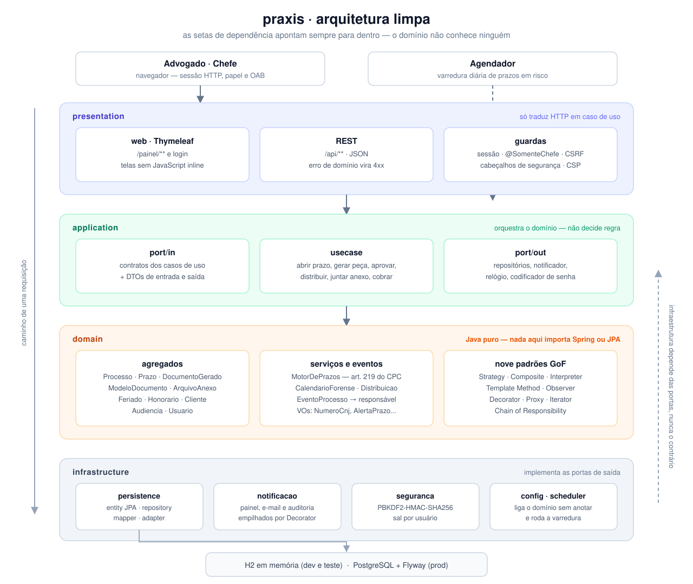

# praxis

Sistema web de gestão para escritórios de advocacia — **processos, prazos e peças**.

Projeto acadêmico da disciplina de Requisitos e Fundamentos de Software (CESAR School), feito com DDD, arquitetura limpa, padrões de projeto GoF, persistência relacional com ORM e cenários BDD automatizados com Cucumber.


---

## O problema

Escritório perde causa por **prazo** e perde tempo por **retrabalho**.

- **Nenhum prazo passa em silêncio.** O advogado lança a intimação; o sistema calcula o vencimento pela regra do CPC (dias úteis, feriados do foro, recesso forense), congela a data e avisa o responsável de forma escalonada — 5, 3, 1 e 0 dias antes, e de novo se o prazo for perdido, sem repetir o mesmo aviso.
- **Nenhuma peça sai sem estrutura nem revisão.** Petição, contestação e procuração nascem de um esqueleto fixo (ou de um modelo cadastrado pelo escritório), ficam nos autos, respeitam o segredo de justiça e só são protocoladas depois da revisão do chefe.
- **Nenhum processo novo fica sem dono.** A distribuição procura primeiro um advogado da área do processo, cai para quem está disponível e, no limite, para quem tem menos processos ativos — sempre avisando o escolhido.
- Em volta: processos com linha do tempo, anexos, feriados, modelos, honorários, audiências, clientes, partes contrárias — e o controle de quem pode o quê (advogado × chefe).

## Como rodar

Só é preciso um **JDK 17** no `PATH`; o Maven vem no wrapper e o banco é em memória.

```bash
./mvnw test            # suíte completa: unidade + contrato HTTP + cenários BDD
./mvnw spring-boot:run # sobe em http://localhost:8080
```

Abra <http://localhost:8080/painel> — o painel inteiro é autenticado. A aplicação sobe com um escritório de mentira montado (processos, prazos em estados diferentes, peça em revisão, clientes, audiência, honorários e anexo), suficiente para percorrer o sistema sem cadastrar nada.

| Papel | Usuário | Senha | OAB |
|---|---|---|---|
| Chefe (admin) | `admin` | `123` | ADMIN |
| Chefe | `carla.mendes` | `praxis123` | PE00001 |
| Advogada | `ana.souza` | `praxis123` | PE12345 |
| Advogado | `bruno.carvalho` | `praxis123` | PE54321 |

Sem `@`, o sistema completa o domínio. Ana responde pelo processo público; Bruno, pelo que corre em segredo de justiça. Entre como `admin` para ver tudo e depois como `ana.souza` para sentir o que um advogado *não* pode fazer.

Console do banco em `/h2-console` (JDBC `jdbc:h2:mem:praxis`, usuário `sa`, sem senha). Desligar a carga de exemplo: `praxis.dados-exemplo=false`. Porta ocupada: `./mvnw spring-boot:run -Dspring-boot.run.arguments=--server.port=8081`.

## As telas

| | |
|---|---|
|  | **Entrar** — usuário curto ou e-mail. E-mail desconhecido e senha errada dão a mesma mensagem, e o freio de força bruta segura a sexta tentativa. |
|  | **Ficha do processo** — linha do tempo, prazos, peças e anexos dos autos. É daqui que se registra andamento e se abre prazo. |
|  | **Gerar peça** — escolhido o modelo, a tela pergunta exatamente os campos que o texto usa (`{{marcadores}}`). |
|  | **Revisão** — peça em revisão só o chefe aprova ou rejeita; o histórico guarda cada transição, e Desfazer volta a última. |
|  | **Administração** — o escritório inteiro em uma tela: volume de cada cadastro e os avisos emitidos. |

O percurso completo, tela a tela, com as regras que o domínio faz cumprir: [`docs/visita-guiada.md`](docs/visita-guiada.md).

## Como é construído

**Stack:** Java 17 · Spring Boot 4.1.1 (WebMVC, Data JPA, Validation, Thymeleaf) · H2 (dev/test) · PostgreSQL + Flyway (prod) · JUnit 5 · Cucumber 7 · JaCoCo · Maven Wrapper.



Leia o desenho de cima para baixo. O navegador entra sempre pelo `presentation`, que só traduz HTTP — quem decide se a requisição prossegue é a faixa de guardas (sessão, `@SomenteChefe`, CSRF, cabeçalhos de segurança). O `application` não tem regra própria: publica os contratos em `port/in`, orquestra o caso de uso e pede o que precisa do mundo externo por `port/out`. No centro, o `domain` é Java puro — agregados, os serviços que aplicam a lei (`MotorDePrazos`, `CalendarioForense`, distribuição) e os nove padrões de projeto.

A camada de baixo é a única que conhece tecnologia, e a seta pontilhada da direita diz por quê: `infrastructure` **implementa** as portas de saída, em vez de o núcleo depender dela. Trocar H2 por PostgreSQL, ou o e-mail por outro canal, é escrever outro adaptador — nenhuma linha de regra de negócio muda. A única entrada que não vem do navegador é o agendador, que dispara a varredura diária direto no caso de uso.

```
presentation/   REST (/api/**) e web Thymeleaf (/painel/**) — só traduz HTTP em caso de uso
application/    port/in (casos de uso), port/out (repositórios), usecase (orquestração)
domain/         processo, prazo, documento, modelo, anexo, feriado, notificacao,
                honorario, agenda, cliente, partecontraria, distribuicao, usuario — Java puro
infrastructure/ persistence (entity + repository JPA + mapper + adapter de port/out),
                notificacao, scheduler, seguranca (PBKDF2), config
```

A regra de dependência é fácil de enunciar e de verificar: **nada no `domain` importa Spring ou JPA**. As entidades JPA vivem só na infraestrutura (`persistence/entity`) e um mapper as converte para os agregados do domínio, então trocar o ORM não toca em regra de negócio. Na prática, a regra do art. 219 do CPC é testável sem subir Spring, sem banco e sem HTTP.

Nove padrões de projeto, cada um por um problema real — Strategy (regimes de contagem e de honorário), Composite (dias não úteis), Template Method (esqueleto da peça), Interpreter (texto do modelo), Observer (andamento e prazo em risco), Decorator (canais de notificação), Proxy (segredo de justiça), Iterator (linha do tempo) e Chain of Responsibility (distribuição: especialidade → disponibilidade → menor carga). Quem faz o quê, e por quê: [`docs/arquitetura.md`](docs/arquitetura.md).

O front não tem framework nem build: uma folha de estilo, um arquivo de comportamento e Thymeleaf. Sem JavaScript inline, porque a CSP não permite — o comportamento mora em `/js/praxis.js` e é ligado por atributos `data-*`.

## Testes

Três camadas, todas em `./mvnw test`:

| Camada | Onde | O que prova |
|---|---|---|
| Domínio | `src/test/java/.../domain` | Regra pura, sem Spring, banco ou HTTP |
| Contrato HTTP | `src/test/java/.../*HttpTest.java` (MockMvc) | Corpo, status de erro e garantias de front e de sessão |
| BDD | 10 `.feature` com 62 cenários em [`src/test/resources/features`](src/test/resources/features) | Os casos de uso reais contra o banco, não dublês |

Os cenários são escritos em português e cobrem acesso ao painel, motor de prazos, geração de documentos, aprovação, feriados, modelos, anexos, agenda, honorários e distribuição.

```bash
./mvnw test -Dtest=MotorDePrazosTest    # um teste
./mvnw verify                           # suíte + cobertura JaCoCo
```

> Estado atual: `distribuicao.feature` entrou sem os steps correspondentes, então seus 3 cenários rodam como *undefined* e a suíte fecha vermelha. Falta criar `DistribuicaoSteps` ao lado de [`HonorariosSteps`](src/test/java/school/cesar/praxis/bdd/HonorariosSteps.java).

O [workflow de CI](.github/workflows/build.yml) roda `verify` com piso de cobertura no JaCoCo e ainda sobe a aplicação no perfil `prod` contra um PostgreSQL de verdade, para provar que a migração do Flyway e as entidades concordam.

## Publicar

[](https://render.com/deploy?repo=https://github.com/joaovictorgcu/praxis)

O repositório traz o [`Dockerfile`](Dockerfile) e o blueprint [`render.yaml`](render.yaml), que cria o PostgreSQL e o serviço web juntos. O Render pede a senha do administrador no Apply — ela não vive no repositório. Passo a passo e o perfil `prod`: [`docs/implantacao.md`](docs/implantacao.md).

## Documentação

| Arquivo | O que tem |
|---|---|
| [`docs/visita-guiada.md`](docs/visita-guiada.md) | As telas em uso e as regras que o domínio faz cumprir |
| [`docs/arquitetura.md`](docs/arquitetura.md) | Arquitetura limpa, DDD nos 4 níveis, padrões, front, segurança e testes |
| [`docs/api-rest.md`](docs/api-rest.md) | Contrato HTTP, com exemplos que mostram as regras funcionando |
| [`docs/implantacao.md`](docs/implantacao.md) | Render, perfil `prod`, PostgreSQL e Flyway |
| [`docs/limitacoes.md`](docs/limitacoes.md) | O que esta entrega ainda não faz, e onde trocar |
| [`docs/dominio.md`](docs/dominio.md) | Descrição do domínio e linguagem onipresente |
| [`docs/mapa-historia-usuario.md`](docs/mapa-historia-usuario.md) | Mapa da história do usuário |
| [`docs/praxis.cml`](docs/praxis.cml) | Subdomínios em Context Mapper |
| [`docs/prototipos/`](docs/prototipos/) | As capturas usadas aqui, e o script que as regera |
| [`docs/declaracao-uso-ia.md`](docs/declaracao-uso-ia.md) | Declaração de uso de IA por participante |
