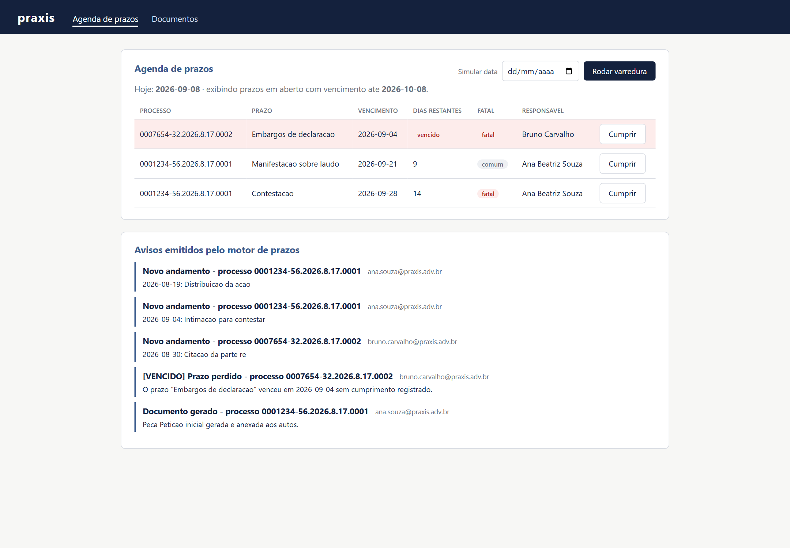
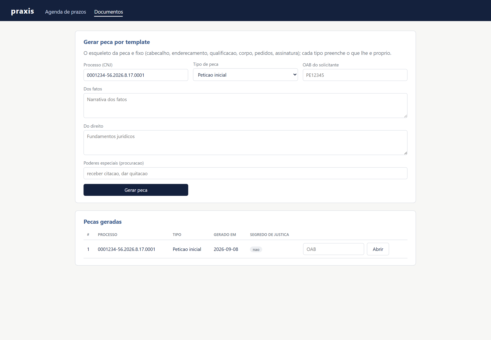
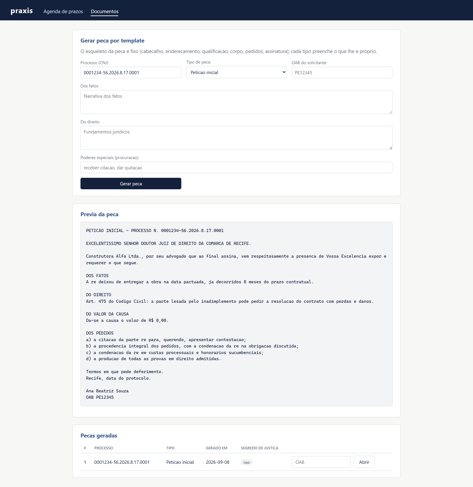

# Protótipos de alta fidelidade

Estes não são mockups de ferramenta de design: são capturas da **interface real em execução**, com dados da carga de exemplo (`DadosDeExemplo`). Servem como protótipo de alta fidelidade porque a tela final é exatamente esta.

Para reproduzir: `./mvnw spring-boot:run` e abrir <http://localhost:8080/painel>.

## 1. Agenda de prazos — `agenda-de-prazos.png`



Tela principal do **motor de prazos**:

- tabela ordenada por vencimento, com destaque visual para prazo vencido (linha vermelha) e prazo crítico (≤ 3 dias, linha âmbar);
- coluna "dias restantes" já calculada no regime de contagem do prazo (dias úteis ou corridos);
- etiqueta `fatal` / `comum`;
- botão **Cumprir** por linha (tira o prazo da varredura);
- campo "Simular data" + **Rodar varredura**, que executa o mesmo caso de uso do job diário — é assim que a banca consegue ver o alerta acontecer sem esperar a data real;
- painel "Avisos emitidos pelo motor de prazos": o que a cadeia de notificação (painel → e-mail → auditoria) entregou.

## 2. Geração de peça por template — `geracao-de-documentos.png`



Tela da **geração de documentos**:

- formulário com processo, tipo de peça (petição inicial, contestação, procuração), OAB do solicitante e os campos livres do template;
- tabela de peças já geradas, com a marca de segredo de justiça;
- para abrir uma peça é obrigatório informar a OAB — a leitura passa pelo `DocumentoProxy`.

## 3. Prévia da peça gerada — `previa-da-peca.png`



Resultado do Template Method: cabeçalho, endereçamento à comarca, qualificação, fatos, direito, pedidos e assinatura com OAB.

## Fluxo de navegação

```
/painel  (agenda de prazos)
   ├── POST /painel/varredura            → roda o motor e volta para a agenda
   ├── POST /painel/prazos/{id}/cumprir  → marca cumprido e volta para a agenda
   └── /painel/documentos                (geração de peças)
          ├── POST /painel/documentos           → gera a peça e mostra a prévia
          └── GET  /painel/documentos/{id}?oab= → abre a peça (passa pelo Proxy)
```
