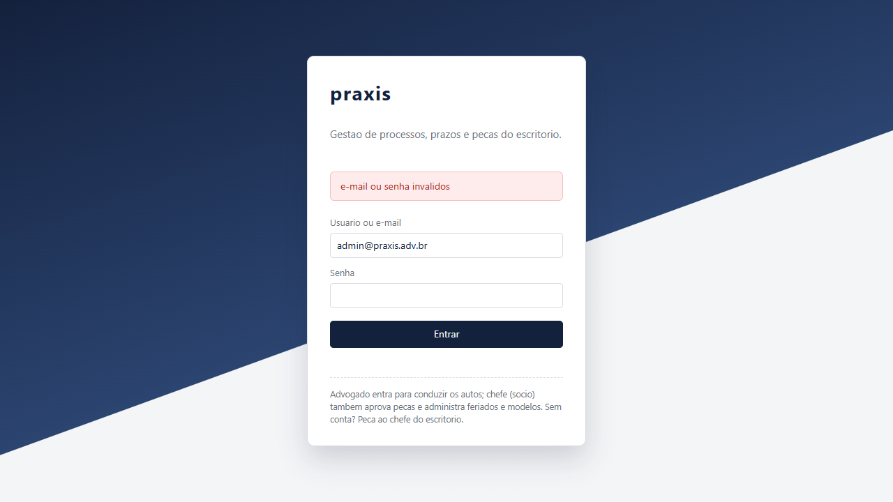
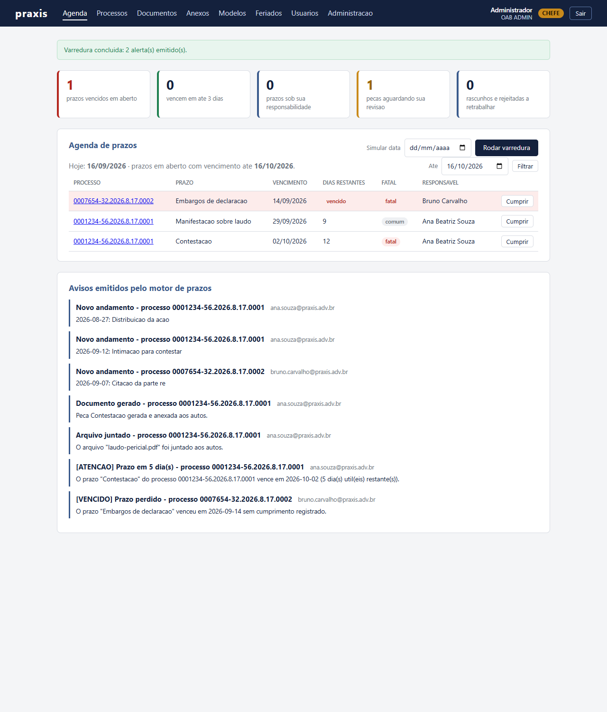
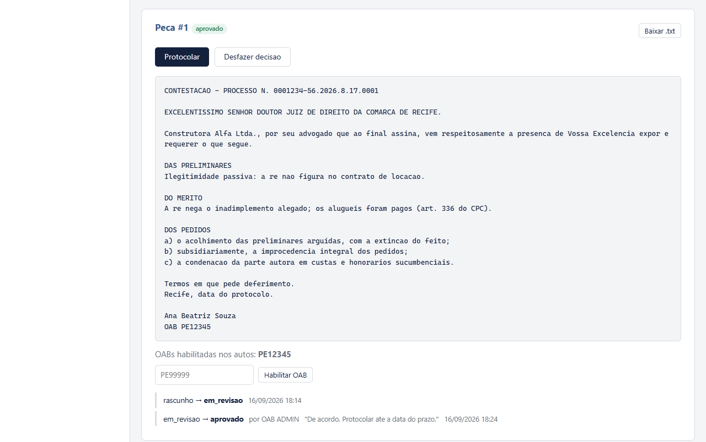
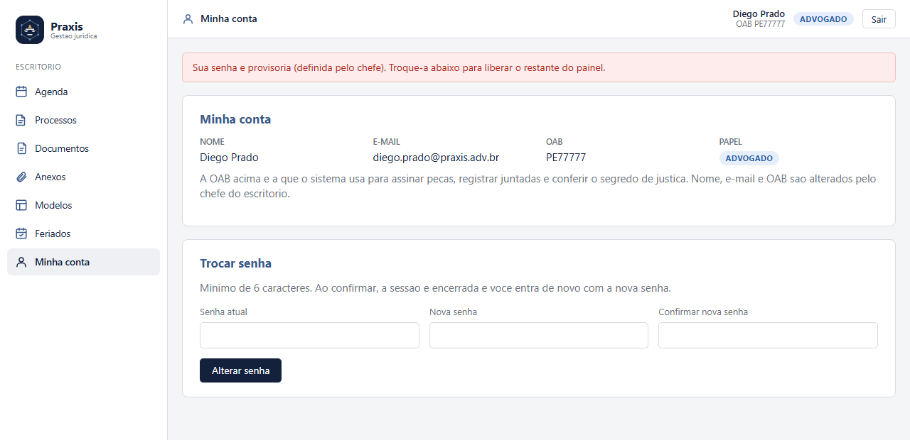
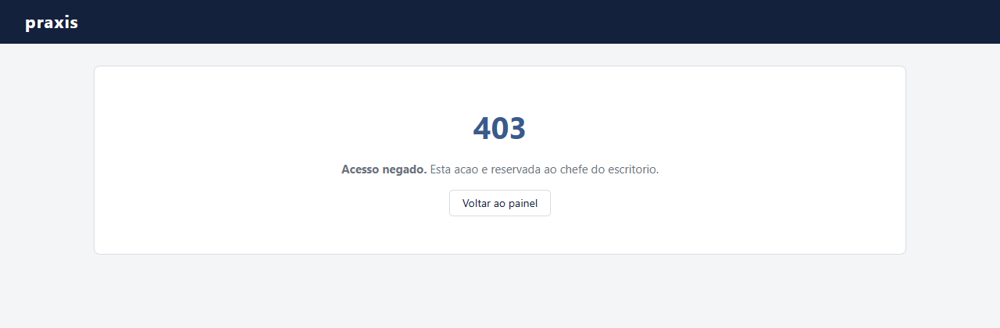

# Visita guiada: um dia no escritorio

Percurso completo pelas telas, com as capturas, e as regras que o dominio faz cumprir. Resumo e como rodar estao no [README](../README.md).

---

Esta seção percorre o sistema na ordem em que ele é usado de verdade. Todas as imagens são capturas da interface real, não desenhos — estão em [`docs/prototipos/`](prototipos/) e são regeradas por script.

### 1. Entrar


A tela aceita o nome curto (`ana.souza`) ou o e-mail inteiro. Nada do painel é visível antes do login.

E quando alguém erra?



A mensagem é **de propósito** vaga. Se o sistema dissesse "usuário não encontrado", qualquer um poderia descobrir quem tem conta no escritório testando e-mails. Errar cinco vezes seguidas bloqueia aquele e-mail por um minuto — um freio simples contra tentativa de senha em massa.

### 2. A agenda do dia


É a primeira tela depois do login, e responde à pergunta que o advogado faz ao chegar: **o que vence hoje?**

- Os cinco contadores no topo separam o que é urgente (prazos vencidos, vencendo em até 3 dias) do que é trabalho acumulado (peças esperando revisão, rascunhos a retrabalhar).
- A agenda lista os prazos **em aberto**, do mais próximo ao mais distante, com a etiqueta `fatal` ou `comum` e o advogado responsável. Prazo cumprido some daqui.
- Embaixo, os avisos que o motor de prazos já emitiu — é a caixa de entrada do escritório.

### 3. Achar o processo


Busca por número CNJ, cliente ou comarca. No cadastro, o responsável é **escolhido entre os usuários do escritório** — não é um nome digitado à mão, porque é a OAB dele que vai assinar as peças e receber os avisos.

### 4. A ficha do processo: onde o trabalho acontece


Esta é a tela mais importante do sistema. Ela reúne, em uma página:

- **O cabeçalho** com cliente, comarca, responsável e a última intimação — e a etiqueta `publico` ou `segredo`.
- **Registrar andamento**: cada movimentação do processo (intimação, citação, audiência, despacho, sentença, juntada). Intimação e citação são as que **iniciam contagem de prazo**.
- **Abrir prazo**: você informa a data da intimação, quantos dias e o regime; o sistema calcula o vencimento. Repare no texto da tela — ele explica a regra que está sendo aplicada, com os artigos do CPC. O usuário não precisa confiar cegamente.
- **Linha do tempo** sempre em ordem cronológica, independente da ordem em que os andamentos foram digitados.
- **Prazos, peças e anexos** daquele processo, cada um com o que falta fazer.

Um detalhe que vale o olhar: o prazo "Contestacao" foi aberto com intimação em 12/09 e 15 dias úteis, e venceu em **02/10/2026** — o sistema pulou fins de semana e feriado. Ninguém contou no calendário de parede.

### 5. O motor de prazos trabalhando

O sistema não espera alguém olhar a agenda. Todo dia útil às 7h ele varre os prazos em aberto e avisa quem precisa ser avisado. Na tela, dá para simular uma data e rodar a mesma varredura na hora:



O que aconteceu aqui:

- O prazo "Embargos de declaracao" venceu em 14/09 e ninguém cumpriu: a linha fica vermelha, o contador de vencidos sobe e sai um aviso **[VENCIDO] Prazo perdido** para o responsável. Perder prazo é grave; o sistema não deixa isso passar em silêncio nem depois do fato consumado.
- O prazo "Contestacao" entrou na faixa de 5 dias e gerou um **[ATENCAO]**.
- A faixa verde diz "2 alerta(s) emitido(s)". Rodar de novo no mesmo dia emite **zero** — cada nível de alerta é avisado uma única vez por prazo. Sem isso, o advogado receberia o mesmo aviso todo dia e pararia de ler.

Os níveis são escalonados por dias úteis restantes: `ATENCAO` (≤5) → `URGENTE` (≤3) → `CRITICO` (≤1) → `VENCE_HOJE` (0) → `VENCIDO`. E, por política padrão do escritório, **só prazo fatal dispara alerta**: prazo comum aparece na agenda, mas não interrompe o dia de ninguém.

### 6. Gerar a peça


O advogado escolhe o processo, o tipo de peça e (opcionalmente) um modelo cadastrado. Quando escolhe o modelo `COBRANCA_ALUGUEL`, a tela **descobre sozinha** quais campos aquele modelo precisa (`enderecoImovel`, `valorDivida`) e pede só esses. Cliente, comarca, número do processo, advogado e OAB não são pedidos: já estão nos autos.

E de onde vêm esses modelos? Do próprio escritório, sem programador:


Você escreve o corpo e os pedidos usando `{{marcadores}}`. Enquanto digita, a linha de baixo mostra quais campos serão pedidos na hora de gerar — os que vêm dos autos aparecem riscados, porque o sistema já os conhece. A caixa "Endereça ao juízo" existe porque uma procuração não se dirige ao juiz: desmarcando, as seções de endereçamento, qualificação e fecho somem de uma vez.

O que o modelo **não** controla é a ordem das seções (cabeçalho → endereçamento → qualificação → corpo → pedidos → assinatura). Isso é regra do domínio, não preferência de quem cadastra.

### 7. A revisão do chefe

Peça gerada nasce como **rascunho**. Ela não vai para o fórum antes de passar por gente:

```
RASCUNHO → EM_REVISAO → APROVADO ou REJEITADO → (aprovado) PROTOCOLADO
```


O chefe vê a peça inteira — com o esqueleto obrigatório preenchido e a assinatura do responsável — e decide. Aprovar aceita um comentário; **rejeitar exige um motivo**, porque devolver trabalho sem dizer o porquê não ajuda ninguém.

Depois de aprovada, a tela muda:



Os botões de aprovar/rejeitar desaparecem e surgem **Protocolar** e **Desfazer decisão**. Embaixo fica o histórico: quem mudou o quê, quando, com qual OAB e com qual comentário. Nada se perde — inclusive um "desfazer", que volta a peça para revisão e **fica registrado** em vez de sumir.

Quem é advogado e não chefe vê, no mesmo lugar, apenas "Aguardando revisao do chefe do escritorio".

### 8. Juntar arquivos aos autos


Nem todo documento nasce dentro do sistema: procuração assinada, comprovante e laudo pericial chegam de fora. A tela diz claramente o que aceita (PDF, JPEG, PNG, texto, até 10 MB) — recusar na porta evita juntar aos autos um arquivo que o juízo não consegue abrir.

Não existe botão de remover. **Documento juntado aos autos não se desanexa**: retirar peça dos autos depende de decisão judicial (desentranhamento), não de um clique.

### 9. Segredo de justiça: a regra que o sistema não deixa esquecer

Processo em segredo de justiça (CPC art. 189) só pode ser lido pelos advogados habilitados nos autos. Veja a mesma ficha de processo, agora com a advogada Ana logada — que **não** está habilitada:


O aviso vermelho não é decoração. A peça e o anexo desse processo respondem **403** para ela — na tela e também na API, se alguém tentar montar a requisição na mão. A checagem vive num Proxy pelo qual todo conteúdo restrito obrigatoriamente passa; é impossível esquecer de conferir, porque não existe caminho que desvie dele. Para liberar, um chefe habilita a OAB dela na peça.

### 10. Feriados: o calendário que alimenta a contagem


Aqui fica o motivo pelo qual a contagem de prazos acerta. Cada feriado tem:

- **Quando incide**: data única (um ponto facultativo de 2026) ou todo ano na mesma data (Natal, Tiradentes).
- **Onde vale**: nacional, estadual (UF) ou da comarca. Feriado de Olinda **não** suspende prazo que corre em Recife — e o sistema sabe disso porque conhece o foro do escritório.

A caixinha "Corre prazo em" responde, para qualquer data, se aquele dia conta — é a forma mais direta de conferir o efeito de um cadastro.

Duas decisões importantes: feriado cadastrado vale já na **próxima contagem**, sem reiniciar a aplicação; e **prazo já lançado não se move**, porque o vencimento foi congelado na abertura. Cadastrar um feriado hoje não pode mudar retroativamente uma data que o advogado já anotou na agenda.

Fim de semana e recesso forense (20/12 a 20/01) não aparecem nessa lista: são regra de lei, ficam no código e ninguém pode apagá-los por engano.

### 11. Pessoas: usuários, papéis e senha provisória


Só o chefe cadastra e remove usuários — com duas travas: ninguém remove a si mesmo, e o escritório não pode ficar sem nenhum chefe.

A senha que o chefe define é **provisória**. Quando o novo usuário entra, o painel fica assim:



Nada além de *Minha conta* funciona até ele trocar a senha — assim o chefe nunca sabe a senha definitiva de ninguém. Repare também no menu: Diego é `ADVOGADO`, então não existe "Administracao" ali.


E se um advogado digitar o endereço da tela de chefe direto na barra do navegador?



Esconder o link do menu é conforto, não segurança. A proteção de verdade está no servidor, e o teste cobre os dois caminhos.

### 12. Administração: o escritório inteiro em uma tela

`/painel/admin`, reservada ao chefe. Antes dela, saber o que o sistema guardava exigia passar por seis telas — e três cadastros (cliente, parte contrária e audiência) **não tinham tela nenhuma**, só API REST.


No topo, os contadores de doze cadastros, cada um ancorado na sua tabela. Os que exigem ação mudam de cor: prazo vencido fica vermelho; peça aguardando revisão e usuário com senha provisória ficam âmbar. A "ficha da instância" (perfil ativo, banco, Flyway, tempo no ar) responde "qual banco esta instância está usando?" sem abrir terminal.


Depois vêm as tabelas, uma seção por cadastro. Os prazos trazem os **já cumpridos** (etiqueta verde), que a agenda do dia esconde, e os vencidos em aberto aparecem com a linha em vermelho.


Os três cadastros sem tela própria aparecem aqui, inclusive os desativados, marcados pela etiqueta de situação.


E, no fim, o que sustenta o resto: modelos de peça, o calendário forense que alimenta a contagem de prazos e a fila de avisos emitidos por esta instância.

**Três decisões desta tela que valem a discussão:**

- **A tela só lê.** Criar e remover continua em cada cadastro, que é onde a regra vive: remover usuário não pode deixar o escritório sem chefe; remover feriado muda a contagem de prazo de todo mundo. Duplicar esses formulários aqui duplicaria a regra — ou, pior, deixaria uma cópia sem ela.
- **Consulta própria, em vez de reaproveitar as do dia a dia.** As listagens existentes servem à tela do dia e por isso escondem o que já saiu de cena (a agenda só devolve prazo em aberto; cliente, parte e audiência filtram os ativos). Mudar esses métodos para trazer tudo estragaria as telas que dependem deles. Foram criadas operações novas — `PrazosUseCases.ListarTodosOsPrazos`, `listarTodosOsClientes()`, `listarTodasAsPartesContrarias()`, `listarTodasAsAudiencias()` — e as antigas ficaram como estavam.
- **`ConsultarPanorama` não fala com repositório.** O `PanoramaAppService` compõe casos de uso que já existem; nenhuma consulta nova desce à persistência por fora das portas. Assim a tela não vira um segundo caminho até o banco, com regra de leitura própria.

E o que ela não deixa vazar: `@SomenteChefe` na classe (advogado que montar a URL recebe `403`); a senha codificada não entra no panorama e portanto não chega ao HTML (`AdminHttpTest` falha se chegar); a URL do banco é mostrada sem os parâmetros, que em alguns drivers carregam credencial.

---

---

## As regras que o domínio faz cumprir

Cada regra abaixo tem teste de unidade ou cenário BDD. Artigos citados são do CPC/2015.

**Processo e andamentos**
- Processo tem número **CNJ** válido (`NNNNNNN-DD.AAAA.J.TR.OOOO`), cliente, comarca e **um advogado responsável** (nome, e-mail, OAB); o número é único.
- Pode nascer em **segredo de justiça** (art. 189): a OAB do responsável fica habilitada nos autos; qualquer outra precisa ser habilitada pelo chefe.
- Andamento tem data, descrição e tipo (intimação, citação, audiência, despacho, sentença, juntada, outro). A linha do tempo é sempre **cronológica**, independente da ordem de registro.
- **Intimação e citação** são os andamentos que iniciam contagem de prazo; registrar andamento avisa o responsável.

**Prazos (motor de prazos)**
- Prazo tem descrição, data da intimação, quantidade de dias (≥ 1), regime e é **fatal** ou comum; o responsável é o do processo.
- Regime **dias úteis** (art. 219, para prazos processuais) ou **dias corridos** (prazos materiais).
- **Termo inicial**: o primeiro dia útil seguinte à intimação (art. 224); o vencimento cai no último dia da contagem e, se for dia sem expediente, prorroga para o próximo útil.
- Não contam como dia útil: **fim de semana**, **feriados** que valem para o foro (nacional, da UF ou da comarca) e o **recesso forense de 20/12 a 20/01** (art. 220). Fim de semana e recesso são regra de lei, não cadastráveis.
- O vencimento é **calculado e congelado na abertura**: cadastrar ou remover feriado depois não move prazo já lançado.
- Alertas por dias contáveis restantes: `ATENCAO` (≤ 5), `URGENTE` (≤ 3), `CRITICO` (≤ 1), `VENCE_HOJE` (0) e `VENCIDO` (em aberto após o vencimento). Sempre o mais severo aplicável.
- **Idempotência por marco**: cada nível é avisado uma única vez por prazo — rodar a varredura duas vezes no dia não repete aviso.
- Política padrão do escritório: **só prazo fatal gera alerta**; prazo comum entra na agenda mas não dispara aviso (existe uma política "inclusiva" para quem quiser o contrário).
- Prazo **cumprido** sai da varredura e não pode ser cumprido de novo.
- A varredura roda todo dia útil às 7h e também sob demanda, pelo mesmo caso de uso; a notificação segue para painel, e-mail (log) e trilha de auditoria em banco.

**Peças (geração de documentos)**
- Toda peça tem o mesmo **esqueleto**: cabeçalho, endereçamento, qualificação, corpo, pedidos e assinatura com nome e OAB do responsável. A ordem é regra do domínio e não pode ser alterada por modelo.
- Tipos compilados: **petição inicial** (fatos, direito), **contestação** (preliminares, mérito) e **procuração ad judicia** (poderes especiais; não se endereça ao juízo). **Peça avulsa** é o tipo dos modelos que não são nenhum dos três.
- A peça **herda o segredo de justiça** do processo e a lista de OABs habilitadas no momento da geração; a OAB de quem gerou entra na lista.
- Leitura de peça sigilosa só por **OAB habilitada** — na tela (OAB da sessão) e na API (`403`). Peça sigilosa exige ao menos uma OAB habilitada; não se revoga a última.
- O tipo da peça registrada vem do **gerador** (modelo ou compilado), não do que o usuário pediu.
- Gerar peça avisa o advogado responsável.

**Fluxo de aprovação da peça**
- Estados: `RASCUNHO → EM_REVISAO → APROVADO | REJEITADO → (APROVADO) PROTOCOLADO`.
- Só rascunho ou rejeitada vai para revisão; só em revisão pode ser aprovada ou rejeitada; só aprovada pode ser protocolada; protocolada não muda mais.
- **Aprovar, rejeitar e desfazer decisão são do chefe**; aprovação exige OAB do aprovador; rejeição exige motivo.
- Desfazer volta a peça para `EM_REVISAO` e fica no histórico; toda transição registra de/para, OAB e comentário.
- Transição inválida é erro do cliente (`409`), nunca do servidor.

**Modelos de peça**
- Modelo tem código único (maiúsculas/underscore), nome, tipo de peça produzida, título opcional, **corpo e pedidos** com marcadores `{{campo}}`, e diz se **endereça ao juízo**.
- Marcadores reservados vêm dos autos: `cliente`, `comarca`, `processo`, `advogado`, `oab`. Qualquer outro é **pedido ao gerar** a peça; o cadastro informa quais.
- Campo não informado vira marcador visível na peça — `(valorDivida a preencher)` — nunca lacuna silenciosa.
- Modelo que não endereça ao juízo dispensa endereçamento, qualificação e fecho de uma vez.
- Editar ou remover modelo não altera peça já gerada (a peça persiste o próprio texto). Remover modelo é ação do chefe.

**Anexos**
- Aceitos: **PDF, JPEG, PNG e texto**, até **10 MB**; o tipo é conferido pelo `Content-Type` e a extensão correta é garantida no nome.
- O nome do arquivo é saneado: caminho de diretório (`../`) é descartado.
- O anexo **copia** segredo de justiça e OABs habilitadas do processo **no momento da juntada**; a leitura passa pelo mesmo Proxy das peças.
- Não existe remoção de anexo: documento juntado aos autos não se desanexa (desentranhamento é decisão judicial).
- Juntada avisa o responsável.

**Feriados e calendário**
- Feriado tem descrição, **recorrência** (data única ou anual fixa) e **abrangência** (nacional, estadual com UF, comarcal com comarca).
- Só entram na contagem os feriados que valem para o **foro do escritório** (`praxis.foro.uf` / `comarca`): feriado de Olinda não suspende prazo em Recife.
- Feriado cadastrado vale na **próxima contagem**, sem reiniciar. Remover feriado é ação do chefe.

**Honorários**
- Contrato por processo em uma de três modalidades: **fixo**, **por hora** (valor × horas) ou **quota litis** (percentual sobre o valor da causa).
- Quota litis acima de **30 %** é recusada (limite ético do Código de Ética da OAB).

**Audiências, clientes e partes contrárias**
- Audiência tem processo, parte autora, início, fim (posterior ao início) e sala; **duas audiências não se sobrepõem na mesma sala**; a edição respeita a mesma regra e conflitos podem ser consultados antes de gravar.
- Cliente (pessoa física ou jurídica) tem CPF/CNPJ **único**; a exclusão é lógica (inativa) e a reativação é possível; a edição é parcial (campo omitido mantém o valor).
- Parte contrária segue o mesmo modelo, sem unicidade de documento.

**Acesso**
- Todo o painel exige login; dois papéis: **advogado** (conduz os autos) e **chefe** (tudo do advogado + aprovar peça, habilitar OAB, remover feriado/modelo, gerir usuários).
- E-mail e OAB são **únicos**; senha mínima de 6 caracteres pela tela; usuário criado pelo chefe entra com **senha provisória** e só libera o painel depois de trocá-la.
- Ninguém remove a si mesmo, e o escritório precisa de **ao menos um chefe**.
- 5 falhas de login seguidas bloqueiam o e-mail por 1 minuto; e-mail desconhecido e senha errada recebem a mesma resposta.

---
